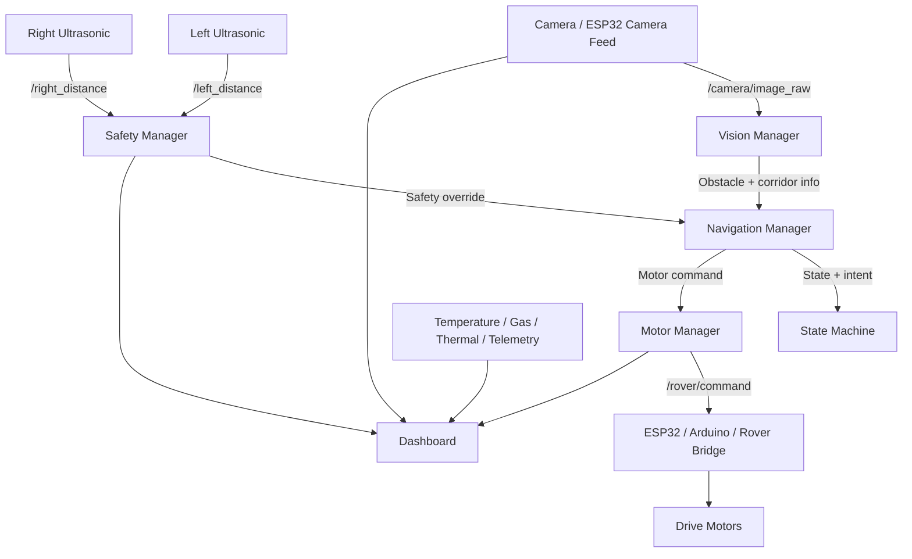

# Mine Safety Rover

A ROS2-based prototype for an autonomous mine and tunnel monitoring rover. This workspace contains the initial system prototype for a compact rover that can inspect dark, narrow, and hazardous underground or tunnel-like environments, detect obstacles, navigate autonomously, and stream live telemetry to a web dashboard.

This project is implemented as a ROS2 workspace with three main packages:

- `drillpulse_autonomous` — autonomous navigation, obstacle avoidance, camera vision, and safety logic
- `drillpulse_control` — low-level rover control and hardware bridge logic
- `rover_dashboard` — browser dashboard for live streaming, telemetry, and operator monitoring

The code here is an early prototype focused on demonstration, validation, and development of an autonomous mine safety rover concept.

---

## 1. Project Overview

The rover is intended for dangerous underground or tunnel environments where human access is difficult or unsafe. The prototype combines:

- camera-based obstacle detection and corridor analysis
- ultrasonic distance sensing for proximity monitoring
- a state machine for decision-making and recovery
- autonomous exploration and point-to-point navigation
- motor command publishing to a rover control bridge
- a live web dashboard for visual monitoring
- thermal and environmental monitoring support through dashboard topics

This is not a fully mature industrial mining robot. It is a practical prototype for research, testing, and concept validation.

---

## 2. What the Project Does

### Main goals

1. Explore an environment without collision
2. Avoid walls, rock edges, and blocked corridors
3. Detect a safe driving path using computer vision
4. Stop or redirect when sensors detect danger
5. Allow point-to-point navigation to target positions
6. Provide live monitoring data through a dashboard
7. Support future integration with gas, temperature, and thermal sensors

### Operational behavior

The autonomous package runs a control loop that:

- reads the latest camera frame
- analyzes the frame for obstacles and a navigable corridor
- reads ultrasonic distances from left and right sensors
- applies safety rules with priority override
- chooses a navigation state such as free roam, point navigation, obstacle avoidance, or emergency stop
- publishes movement commands to the rover motor interface

---

## 3. System Architecture



---

## 4. Workspace Structure

```text
ros2_ws/
├── README.md
├── setup_install.bash
├── yolo11n-seg.pt
├── build/
├── install/
├── log/
└── src/
    ├── drillpulse_autonomous/
    │   └── drillpulse_autonomous/
    │       ├── config/
    │       ├── launch/
    │       ├── scripts/
    │       ├── drillpulse_autonomous/
    │       │   ├── autonomous_controller.py
    │       │   ├── state_machine.py
    │       │   ├── navigation_manager.py
    │       │   ├── free_roam_mode.py
    │       │   ├── point_navigation_mode.py
    │       │   ├── vision_manager.py
    │       │   ├── camera_stream.py
    │       │   ├── obstacle_detector.py
    │       │   ├── ultrasonic_manager.py
    │       │   ├── safety_manager.py
    │       │   ├── motor_manager.py
    │       │   ├── coordinate_manager.py
    │       │   ├── path_planner.py
    │       │   ├── utils.py
    │       │   └── ...
    │       ├── package.xml
    │       ├── setup.py
    │       └── README.md
    │
    ├── drillpulse_control/
    │   ├── drillpulse_control/
    │   │   ├── drillpulse_rover_node.py
    │   │   ├── cam_node.py
    │   │   └── ...
    │   ├── package.xml
    │   └── setup.py
    │
    └── rover_dashboard/
        ├── rover_dashboard/
        │   ├── dashboard.py
        │   ├── thermal.py
        │   └── web/
        ├── launch/
        ├── package.xml
        ├── setup.py
        └── README.md
```

---

## 5. Package-by-Package Description

### 5.1 `drillpulse_autonomous`

This is the main autonomous intelligence package. It contains the logic for navigation, obstacle detection, recovery, and control planning.

#### `autonomous_controller.py`
This is the central ROS2 node that initializes the entire autonomous system.

It does the following:

- declares ROS parameters such as camera topic, ultrasonic topics, motor command topic, speed topic, thresholds, frame size, and simulation mode
- creates all subsystem managers (vision, ultrasonic, safety, motor, coordinate, navigation)
- starts the main control loop at a fixed timer rate
- calls the navigation manager each loop
- handles emergency shutdown behavior

#### `state_machine.py`
Defines the operating states for the rover:

- `IDLE`
- `FREE_ROAM`
- `POINT_NAVIGATION`
- `OBSTACLE_AVOIDANCE`
- `RECOVERY`
- `GOAL_REACHED`
- `EMERGENCY_STOP`

This allows the rover to change behavior according to the situation and prioritize safety over navigation.

#### `navigation_manager.py`
This is the main coordinator. It receives the camera and sensor outputs and decides what the rover should do next.

It chooses the behavior between:

- free roaming
- point-to-point target navigation
- obstacle avoidance
- recovery maneuvers
- emergency stop and safe reset

#### `free_roam_mode.py`
Handles autonomous wandering in an open or partially blocked area.

This mode is used to let the vehicle explore without a predefined target. It may process obstacles, adjust heading, and keep moving while avoiding collisions.

#### `point_navigation_mode.py`
Handles navigation toward a specific goal. It uses stored coordinates and computes direction, motion, and route adjustments toward that goal.

This is useful for moving between waypoints or target points in a tunnel or mine corridor.

#### `vision_manager.py`
Coordinates the camera stream and obstacle detection pipeline.

It:

- grabs the latest frame from the camera stream
- runs the detector on the frame
- overlays diagnostic data such as FPS, obstacle boxes, steering arrows, and safety state
- opens a live OpenCV visualization window

#### `camera_stream.py`
Handles camera input and the image acquisition pipeline.

It supports:

- ROS image subscriptions
- simulation mode with a webcam fallback
- image resizing and output to the detector pipeline

#### `obstacle_detector.py`
This is the main vision-processing component. It uses OpenCV operations such as edge detection, contour processing, and corridor analysis to determine if there is a clear path.

It creates the visual understanding used by the navigation pipeline.

#### `ultrasonic_manager.py`
Receives and processes ultrasonic sensor data from left and right sensors.

It may filter noise, track the latest values, and provide distance-based warnings for safe/unsafe navigation.

#### `safety_manager.py`
This is the high-priority safety module. It enforces rules such as:

- critical stop when obstacles are too close
- warning distance when obstacles are near
- override of navigation commands during risky conditions
- safe recovery behavior

This is one of the most important modules in a mine or tunnel environment.

#### `motor_manager.py`
Converts the planner’s decisions into commands for the rover hardware.

It publishes movement strings or commands on the topic expected by the rover bridge, such as `/rover/command`.

#### `coordinate_manager.py`
Tracks the rover’s internal coordinate frame and target points.

This is used to manage navigation to a goal and maintain information such as destination points and location estimates.

#### `path_planner.py`
Generates movement plans or route logic based on the available open space and target position.

This helps transform raw obstacle/visibility information into a practical path or steering action.

#### `utils.py`
Contains helper functions such as color-coded logging, math utilities, and orientation helpers.

---

### 5.2 `drillpulse_control`

This package is intended to handle low-level rover control and hardware interfacing.

#### `drillpulse_rover_node.py`
This is the main control node for the rover hardware interface. It contains the command logic for:

- joystick or keyboard-driven motion
- speed mode handling
- Bluetooth/serial command channel management
- odometry or predicted motion control
- rover state supervision

The code clearly suggests a serial/Bluetooth bridge to a microcontroller or motor controller board, and it preserves a command protocol such as:

- `CMD,X,Y`
- motor direction and speed packets
- stop commands
- Bluetooth watchdog-style keepalive packets

This file is a more low-level control layer and is designed for a physical rover bridge connected to motors and hardware.

#### `cam_node.py`
This likely handles a camera input or hardware camera publishing path so that the autonomous vision pipeline can operate using video stream data.

---

### 5.3 `rover_dashboard`

This package provides a browser dashboard for monitoring the rover.

#### `dashboard.py`
This is the ROS2 web dashboard node.

It:

- creates a Flask + Socket.IO server
- exposes a browser UI on port 8080 by default
- subscribes to telemetry topics
- converts camera images into JPEG data for browser display
- emits sensor values to the frontend
- allows status and telemetry monitoring in real time

The dashboard can display:

- live camera feed
- thermal image feed
- left/right distance values
- temperature
- humidity
- gas status
- speed mode
- motor values
- joystick values
- system status

#### `thermal.py`
This likely handles thermal feed generation or thermal monitoring support for the dashboard.

#### `web/`
Contains the frontend web files used by the dashboard, including the HTML, styling, and JavaScript for browser visualization.

---

## 6. ROS Topic Matching in This Project

Here is the actual topic usage present in the workspace.

### Autonomous package expected topics

These are declared in the autonomous node and config file:

| Topic | Type | Used by | Purpose |
|---|---|---|---|
| `/camera/image_raw` | `sensor_msgs/msg/Image` | Vision | Main camera feed |
| `/left_distance` | `std_msgs/msg/Float32` | Ultrasonic manager | Left sensor range |
| `/right_distance` | `std_msgs/msg/Float32` | Ultrasonic manager | Right sensor range |
| `/rover/command` | `std_msgs/msg/String` | Motor manager | Commands such as `CMD,X,Y` |
| `/speed_mode` | `std_msgs/msg/Int32` | Motor manager | Speed mode selection |

These are defined in:

- `src/drillpulse_autonomous/drillpulse_autonomous/config/autonomous.yaml`
- `src/drillpulse_autonomous/drillpulse_autonomous/drillpulse_autonomous/autonomous_controller.py`

### Dashboard topic subscriptions

The dashboard listens to topics like:

| Topic | Type | Purpose |
|---|---|---|
| `/live_feed` | `sensor_msgs/msg/Image` | Live camera image |
| `/thermal_feed` | `sensor_msgs/msg/CompressedImage` | Thermal feed |
| `/live_marked_feed` | `sensor_msgs/msg/CompressedImage` | Annotated vision stream |
| `/drillpulse/temperature` | `std_msgs/msg/Float32` | Temperature |
| `/drillpulse/humidity` | `std_msgs/msg/Float32` | Humidity |
| `/drillpulse/gas` | `std_msgs/msg/Int32` | Gas reading |
| `/drillpulse/gas_status` | `std_msgs/msg/Int32` | Gas alarm state |
| `/drillpulse/left_distance` | `std_msgs/msg/Float32` | Left distance |
| `/drillpulse/right_distance` | `std_msgs/msg/Float32` | Right distance |
| `/drillpulse/speed_mode` | `std_msgs/msg/Int32` | Speed mode |
| `/drillpulse/motor_left` | `std_msgs/msg/Int32` | Left motor status |
| `/drillpulse/motor_right` | `std_msgs/msg/Int32` | Right motor status |
| `/drillpulse/status` | `std_msgs/msg/String` | Rover status |
| `/joystick_values` | `sensor_msgs/msg/Joy` | Gamepad state |

The dashboard code is in:

- `src/rover_dashboard/rover_dashboard/dashboard.py`

### Important note on topic names

This workspace contains a mixed topic naming scheme:

- the autonomous controller expects topics such as `/camera/image_raw`, `/left_distance`, `/right_distance`
- the dashboard expects topics such as `/drillpulse/left_distance`, `/drillpulse/right_distance`, `/drillpulse/speed_mode`

This is normal in an evolving prototype. To make the whole system work together, use ROS remapping or republish the data to consistent topic names.

Example:

```bash
ros2 topic pub /left_distance std_msgs/msg/Float32 "{data: 30.0}"
ros2 topic pub /drillpulse/left_distance std_msgs/msg/Float32 "{data: 30.0}"
```

or launch with remaps:

```bash
ros2 launch rover_dashboard dashboard.launch.py \
  left_distance_topic:=/left_distance \
  right_distance_topic:=/right_distance \
  speed_mode_topic:=/speed_mode
```

---

## 7. Physical Build Concept

This prototype is designed around a small rover chassis with a motorized drivetrain. A typical physical build is:

### Suggested hardware

- 4-wheel rover chassis or tracked chassis
- DC motors with gearbox
- motor driver module (e.g., L298N, BTS7960, or motor controller board)
- microcontroller or onboard computer such as:
  - Raspberry Pi 4 / 5
  - Jetson Nano
  - Intel NUC or similar
- ESP32-CAM or USB webcam for vision
- ultrasonic sensors on the left and right sides
- LiPo battery or DC supply with proper voltage regulation
- USB or serial connection between control board and onboard computer
- optional thermal camera, gas sensor, and humidity sensor

### Typical connections

- Camera stream to onboard computer via USB or ESP32-CAM Wi-Fi/serial bridge
- Ultrasonic sensors to ESP32 or microcontroller GPIO pins
- Motor driver connected to the controller board and battery
- ESP32/Arduino acting as rover hardware bridge
- ROS2 running on the compute platform
- Dashboard served over Wi-Fi or local network

### Example connection pattern

```text
Raspberry Pi / ROS2 computer
        |
        |-- USB camera / ESP32-CAM
        |-- serial / Bluetooth / UART to microcontroller
        |-- Wi-Fi for dashboard access
        |
Motor driver <---> DC motors
Ultrasonic left/right <---> controller or compute board
```

### Communication flow

1. Camera sends image frame to ROS topic
2. Ultrasonic sensors publish distance values
3. Autonomous node analyzes the sensor data
4. Rover uses safety logic and path planning
5. Commands are sent to the hardware bridge
6. Hardware bridge drives motors
7. Dashboard shows live data from all sensors and statuses

---

## 8. Build and Run Instructions

### Requirements

This workspace is built for ROS2 Linux. The environment used in this project is based on ROS2 Jazzy, as shown in the setup script.

### 1. Source ROS2

```bash
source /opt/ros/jazzy/setup.bash
```

### 2. Create and activate Python environment

```bash
cd ~/ros2_ws
python3 -m venv .venv
source .venv/bin/activate
```

### 3. Install dependencies

```bash
python -m pip install --upgrade pip setuptools wheel
python -m pip install flask flask-socketio python-socketio opencv-python ultralytics lap numpy pyyaml colcon-common-extensions
```

### 4. Build the workspace

```bash
cd ~/ros2_ws
colcon build --packages-select drillpulse_autonomous rover_dashboard drillpulse_control --event-handlers console_direct+
source install/setup.bash
```

### 5. Run static auto-build helper script

The included script `setup_install.bash` can set up the environment and build the rover packages automatically.

```bash
cd ~/ros2_ws
bash setup_install.bash
```

---

## 9. Launch Commands

### Start the autonomous node

Free roam mode:

```bash
ros2 launch drillpulse_autonomous autonomous.launch.py mode:=free
```

Point-to-point mode:

```bash
ros2 launch drillpulse_autonomous autonomous.launch.py mode:=point goal_x:=2.0 goal_y:=4.0
```

### Start the dashboard

```bash
ros2 launch rover_dashboard dashboard.launch.py
```

### If using a custom remap setup

```bash
ros2 launch rover_dashboard dashboard.launch.py \
  live_feed_topic:=/camera/image_raw \
  thermal_feed_topic:=/thermal_feed \
  left_distance_topic:=/left_distance \
  right_distance_topic:=/right_distance \
  speed_mode_topic:=/speed_mode
```

---

## 10. Example Behavior of the Rover

A typical run loop may work like this:

1. The camera captures a frame and looks for a corridor or open space.
2. The vision system calculates obstacle layout and direction suggestions.
3. Ultrasonic sensors report left and right ranges.
4. Safety manager sees if anything is dangerously close.
5. If safe, the navigation manager chooses forward motion or steering adjustment.
6. If blocked, the rover may reverse, rotate, or try another heading.
7. A dashboard shows the image feed and sensor values in real time.
8. The operator can monitor the rover for mine safety or remote inspection missions.

---

## 11. Safety and Operating Limitations

This project is an initial prototype and should be treated as a development system, not a fully certified mine-safe industrial machine.

### Current limitations

- no real mine-grade localization or SLAM enforcement
- no industrial safety certification
- sensor values are used for demonstration and local navigation, not final mine-grade compliance
- obstacle avoidance is prototype-level and depends on camera and ultrasonic quality
- any serial/Bluetooth bridge must be tested carefully in the real hardware setup
- low-level motion logic is based on software-predicted rover motion and hardware integration assumptions

### Safety recommendations

- keep the rover mechanically constrained during tests
- test in a controlled area before tunnel deployment
- add emergency stop hardware and watchdog protection
- verify all wiring and battery safety before field use
- apply proper enclosure and dust protection for mining environments

---

## 12. Future Expansion Ideas

This prototype is a foundation for a more capable mine safety rover. Suggested next steps include:

- real GPS / UWB / SLAM localization
- gas detection and hazardous atmosphere monitoring
- 3D point cloud mapping
- thermal anomaly detection
- autonomous waypoint mapping for mine tunnels
- remote operator control via web interface
- rule-based or learning-based obstacle prediction
- teleoperation fallback mode
- autonomous return-to-base behavior

---

## 13. Summary

This workspace represents an initial autonomous rover system prototype for mine and tunnel monitoring. It brings together:

- computer vision for path detection
- ultrasonic sensing for wall and obstacle awareness
- state-based control for safe motion
- ROS2 architecture for modular software
- a browser dashboard for live monitoring
- an expandable hardware/software base for future mine safety robotics

The project is a strong starting point for building a real-world autonomous inspection rover for underground environments.

---

## 14. Quick Start Summary

```bash
cd ~/ros2_ws
source /opt/ros/jazzy/setup.bash
source .venv/bin/activate
colcon build --packages-select drillpulse_autonomous rover_dashboard drillpulse_control
source install/setup.bash

ros2 launch drillpulse_autonomous autonomous.launch.py mode:=free
ros2 launch rover_dashboard dashboard.launch.py
```

Then open the browser dashboard, usually on:

```text
http://<rover-ip>:8080/
```

---

## 15. License

This project is provided as a prototype and is currently intended for research, testing, and educational development. The package manifests in this workspace show the use of MIT-style licensing conventions in several modules.

---

## 16. Final Note

This repository is best understood as an early working prototype of a mine safety rover. The combination of camera vision, ultrasound safety monitoring, autonomous drive logic, and dashboard telemetry is a good foundation for a real underground inspection robot.

If you want to turn this into a production mine robot, the next major improvements are rugged hardware, safer control logic, industrial-grade localization, and full environmental hazard monitoring.
