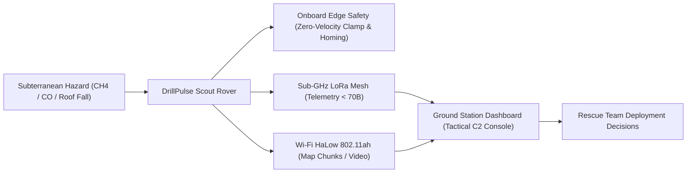
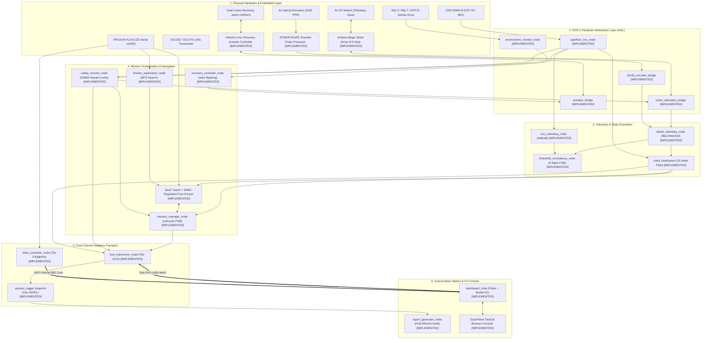
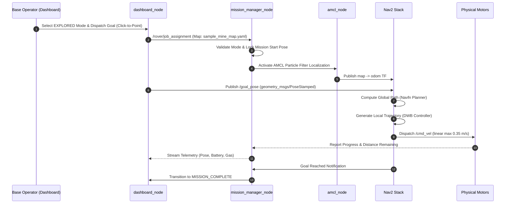
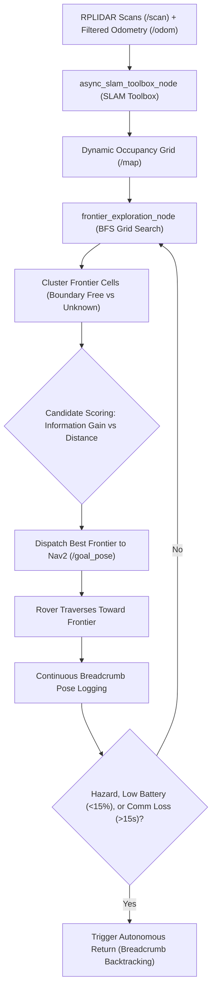
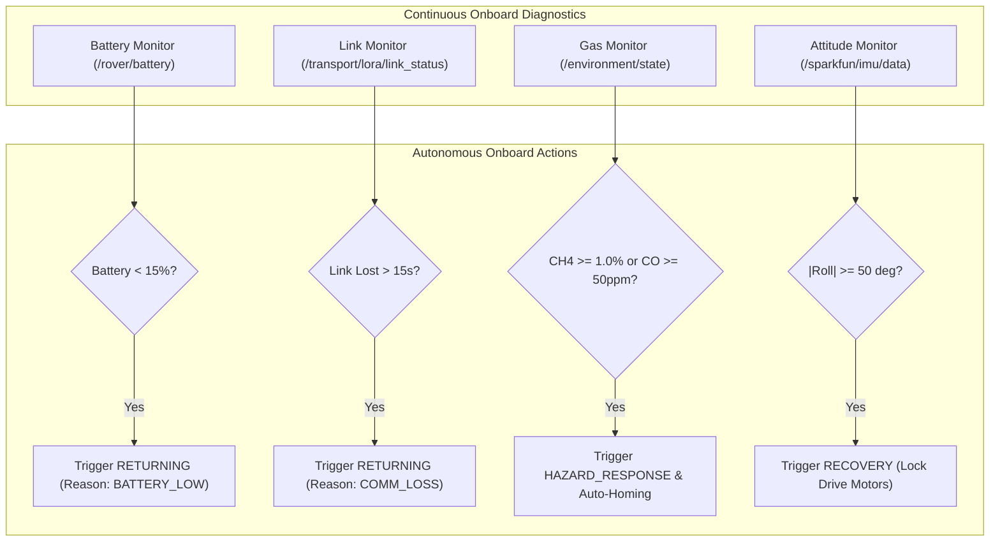
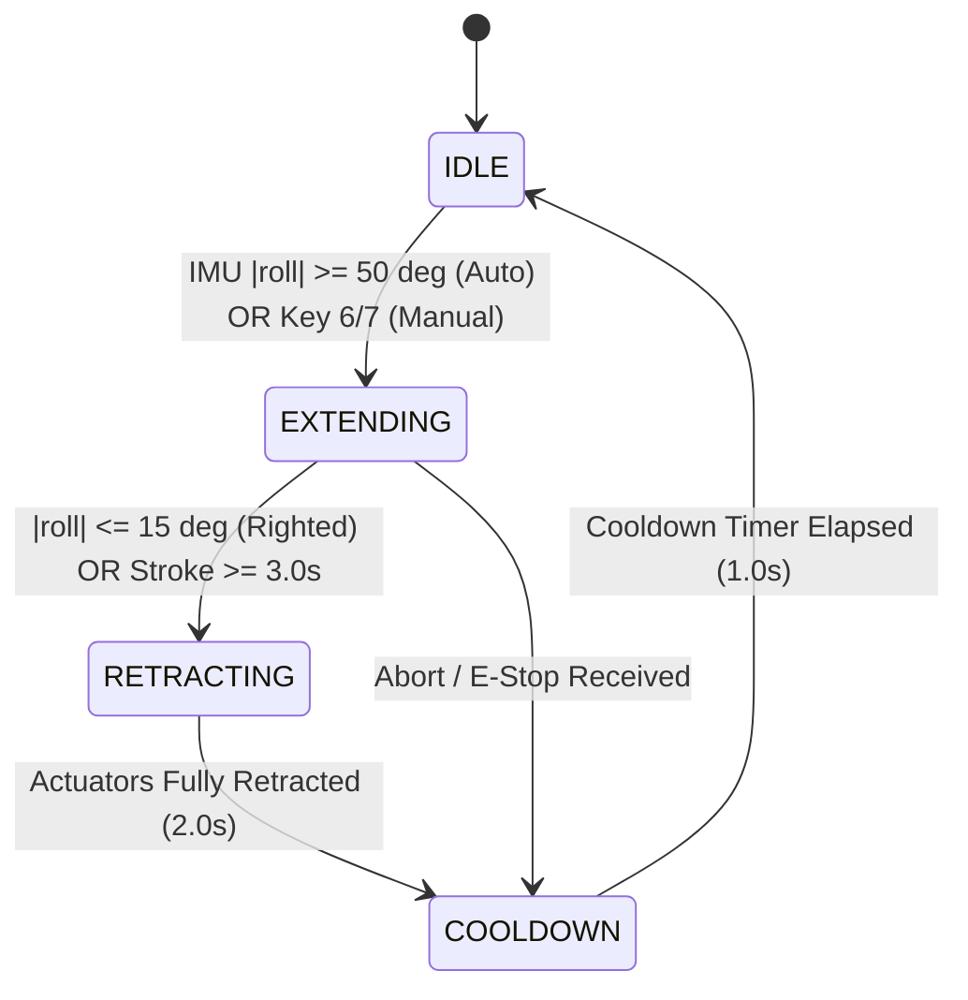
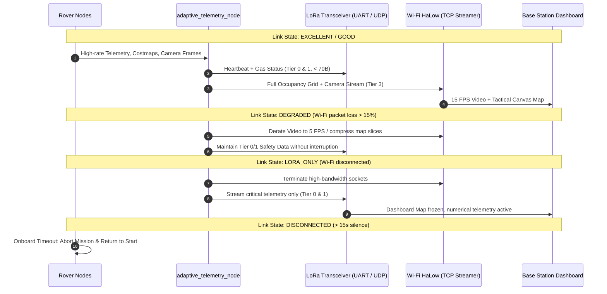
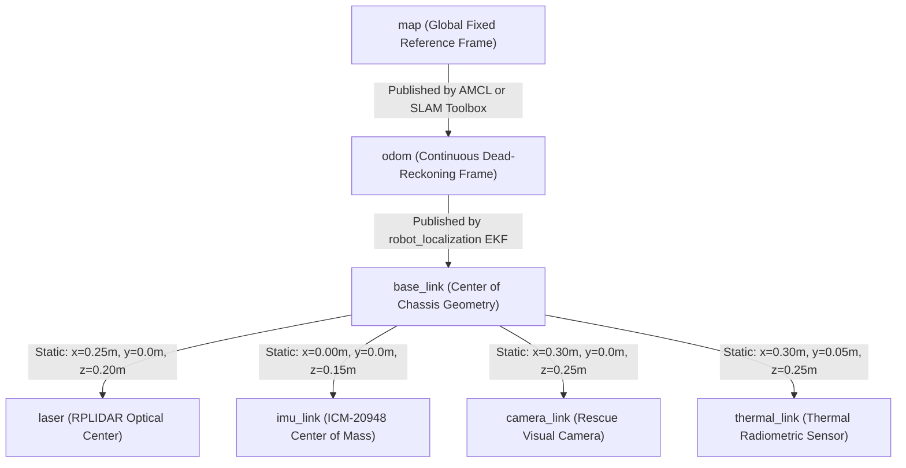

# DrillPulse
## AI-Powered Underground Mine Safety, Monitoring & Rescue Rover

[](https://docs.ros.org/en/jazzy/)
[](https://ubuntu.com/)
[](https://www.python.org/)
[](#hardware-architecture)
[](#automated-testing--verification)
[](#license)

---

## Table of Contents
1. [Executive Summary & Problem Statement](#1-executive-summary--problem-statement)
2. [Engineering Implementation Taxonomy](#2-engineering-implementation-taxonomy)
3. [System Architecture](#3-system-architecture)
4. [End-to-End Data Flow](#4-end-to-end-data-flow)
5. [Explored Mode (AMCL & Nav2)](#5-explored-mode-amcl--nav2)
6. [Unexplored Mode (SLAM & Frontier Exploration)](#6-unexplored-mode-slam--frontier-exploration)
7. [Navigation Architecture](#7-navigation-architecture)
8. [Odometry & Multi-Sensor State Estimation](#8-odometry--multi-sensor-state-estimation)
9. [Sensor Validation & Edge Intelligence](#9-sensor-validation--edge-intelligence)
10. [Linear Actuator Rollover Recovery System](#10-linear-actuator-rollover-recovery-system)
11. [Hazard Management & Safety Supervisor](#11-hazard-management--safety-supervisor)
12. [Communication Architecture & Adaptive Telemetry](#12-communication-architecture--adaptive-telemetry)
13. [Ground Station Web Dashboard](#13-ground-station-web-dashboard)
14. [Mission Logging & Post-Mission Reporting](#14-mission-logging--post-mission-reporting)
15. [Hardware Architecture & Pinouts](#15-hardware-architecture--pinouts)
16. [Microcontroller Firmware Specifications](#16-microcontroller-firmware-specifications)
17. [Repository Structure](#17-repository-structure)
18. [Package-by-Package Breakdown](#18-package-by-package-breakdown)
19. [Core Source File Inventory](#19-core-source-file-inventory)
20. [Canonical ROS 2 Topic Contracts](#20-canonical-ros-2-topic-contracts)
21. [Coordinate Transformation Hierarchy (TF Tree)](#21-coordinate-transformation-hierarchy-tf-tree)
22. [Installation & Prerequisites](#22-installation--prerequisites)
23. [Build Instructions](#23-build-instructions)
24. [Execution & Bringup](#24-execution--bringup)
25. [Automated Testing & Verification](#25-automated-testing--verification)
26. [Troubleshooting & Diagnostics](#26-troubleshooting--diagnostics)
27. [Prototype Evolution & Version Comparison](#27-prototype-evolution--version-comparison)
28. [System Limitations & Operational Boundaries](#28-system-limitations--operational-boundaries)
29. [Developer Navigation Guide](#29-developer-navigation-guide)
30. [Important Development Status & Field Notice](#30-important-development-status--field-notice)

---

## 1. Executive Summary & Problem Statement

### The Subterranean Challenge
Deep underground mining environments (coal, metalliferous, and evaporite) represent some of the most extreme operating envelopes on Earth:
- **Atmospheric Toxicity & Explosion**: Build-up of firedamp ($CH_4$) near the Lower Explosive Limit (LEL $\approx 5\%$) and toxic afterdamp ($CO$) following strata friction, coal oxidation, or blasting.
- **RF Attenuation & Multipath**: High-frequency radio signals (2.4 GHz / 5.8 GHz Wi-Fi) suffer massive attenuation through solid granite, basalt, and coal pillars, rendering conventional teleoperation useless past 1-2 unrepeated drift turns.
- **GPS-Denied Structural Disruption**: Zero satellite reception, complete darkness (0 lux), high relative humidity ($>90\%RH$), and airborne dust creating optical backscatter.
- **Unstructured Obstacle Terrain**: Floor heave, fallen roof rock, water pooling, mud, and steep cross-drift dips creating severe vehicle rollover hazards.

### The DrillPulse Solution
**DrillPulse** is an autonomous and tele-supervised 6-wheel rocker-bogie underground reconnaissance and rescue rover. Operating on **ROS 2 Jazzy** (Ubuntu 24.04) and multi-tier embedded firmware, DrillPulse acts as an expendable scout deployed before human rescue teams enter compromised drifts.


```mermaid
flowchart LR
    A["Subterranean Hazard (CH4 / CO / Roof Fall)"] --> B["DrillPulse Scout Rover"]
    B --> C["Onboard Edge Safety (Zero-Velocity Clamp & Homing)"]
    B --> D["Sub-GHz LoRa Mesh (Telemetry < 70B)"]
    B --> E["Wi-Fi HaLow 802.11ah (Map Chunks / Video)"]
    D --> F["Ground Station Dashboard (Tactical C2 Console)"]
    E --> F
    F --> G["Rescue Team Deployment Decisions"]
```

---

## 2. Engineering Implementation Taxonomy

To maintain strict scientific and engineering rigor, all capabilities documented in this repository are categorized according to their actual verification level:

- `[IMPLEMENTED]`: Complete, verified software implementation written, built, and functioning in the active workspace.
- `[PARTIALLY IMPLEMENTED]`: Core logic exists in code but specific secondary branches, hardware interfaces, or edge-case routines are pending completion.
- `[SIMULATION / FALLBACK]`: Algorithms verified with simulated sensors, software loopbacks, or virtual Gazebo/test environments.
- `[CONFIGURED BUT NOT VERIFIED]`: Node parameters, Nav2 costmaps, or launch files configured according to specifications, but awaiting physical field validation.
- `[PLANNED / NOT IMPLEMENTED]`: Architectural concepts designed for future revisions, with placeholders or interfaces specified.

---

## 3. System Architecture

The DrillPulse software architecture enforces strict decoupling between high-level autonomous navigation, safety supervision, communication transport, and low-level embedded hardware control:


```mermaid
flowchart TD
    subgraph HARDWARE_LAYER ["1. Physical Hardware & Embedded Layer"]
        MOTORS["6x DC Motors (Planetary Gear)"]
        ACTUATORS["Dual Linear Recovery Jacks (150mm)"]
        ENCODERS["6x Optical Encoders (1040 PPR)"]
        IMU_HW["ICM-20948 (9-DOF I2C IMU)"]
        LIDAR_HW["RPLIDAR A1/A2 (2D Serial LiDAR)"]
        GAS_HW["MQ-4 / MQ-7 / DHT22 Sensor Array"]
        LORA_HW["SX1262 / SX1276 LoRa Transceiver"]
        ARD_MOTOR["Arduino Mega: Motor Driver & E-Stop [IMPLEMENTED]"]
        ARD_ACT["Arduino Uno: Recovery Actuator Controller [IMPLEMENTED]"]
        STM32_ENC["STM32F401RE: Encoder Pulse Processor [IMPLEMENTED]"]
    end

    subgraph DRIVER_LAYER ["2. ROS 2 Hardware Abstraction Layer (HAL)"]
        MOT_BRIDGE["motor_telemetry_bridge [IMPLEMENTED]"]
        ACT_BRIDGE["actuator_bridge [IMPLEMENTED]"]
        ENC_BRIDGE["stm32_encoder_bridge [IMPLEMENTED]"]
        IMU_NODE["sparkfun_imu_node [IMPLEMENTED]"]
        ENV_NODE["environment_monitor_node [IMPLEMENTED]"]
    end

    subgraph ESTIMATION_LAYER ["3. Odometry & State Estimation"]
        WHEEL_ODOM["wheel_odometry_node (Slip Detection) [IMPLEMENTED]"]
        IMU_ODOM["imu_odometry_node (Attitude) [IMPLEMENTED]"]
        THRESH_NODE["threshold_consistency_node (5-State FSM) [IMPLEMENTED]"]
        EKF_NODE["robot_localization (15-State Filter) [IMPLEMENTED]"]
    end

    subgraph AUTONOMY_LAYER ["4. Mission Orchestration & Navigation"]
        MISSION_MGR["mission_manager_node (Lifecycle FSM) [IMPLEMENTED]"]
        FRONTIER_NODE["frontier_exploration_node (BFS Search) [IMPLEMENTED]"]
        NAV2_STACK["Nav2: Navfn + DWB / Regulated Pure Pursuit [IMPLEMENTED]"]
        SAFETY_MON["safety_monitor_node (DGMS Hazard Locks) [IMPLEMENTED]"]
        RECOVERY_MGR["recovery_controller_node (Auto-Righting) [IMPLEMENTED]"]
    end

    subgraph TRANSPORT_LAYER ["5. Dual-Channel Adaptive Transport"]
        LORA_NODE["lora_transceiver_node (Tier 0/1/2) [IMPLEMENTED]"]
        VIDEO_NODE["video_streamer_node (Tier 3 Adaptive) [IMPLEMENTED]"]
        LOGGER_NODE["session_logger (Append-Only JSONL) [IMPLEMENTED]"]
    end

    subgraph STATION_LAYER ["6. Ground Base Station & C2 Console"]
        DASHBOARD_NODE["dashboard_node (Flask + Socket.IO) [IMPLEMENTED]"]
        REPORT_NODE["report_generator_node (Post-Mission Audit) [IMPLEMENTED]"]
        WEB_UI["Dual-Panel Tactical Browser Console [IMPLEMENTED]"]
    end

    %% Connections
    MOTORS <--> ARD_MOTOR
    ACTUATORS <--> ARD_ACT
    ENCODERS --> STM32_ENC
    ARD_MOTOR <--> MOT_BRIDGE
    ARD_ACT <--> ACT_BRIDGE
    STM32_ENC --> ENC_BRIDGE
    IMU_HW --> IMU_NODE
    GAS_HW --> ENV_NODE

    MOT_BRIDGE & ENC_BRIDGE --> WHEEL_ODOM
    IMU_NODE --> IMU_ODOM
    WHEEL_ODOM & IMU_ODOM --> THRESH_NODE
    WHEEL_ODOM & IMU_NODE --> EKF_NODE

    EKF_NODE --> NAV2_STACK & MISSION_MGR
    LIDAR_HW --> NAV2_STACK & FRONTIER_NODE
    FRONTIER_NODE --> NAV2_STACK
    NAV2_STACK <--> MISSION_MGR
    ENV_NODE & IMU_NODE --> SAFETY_MON
    SAFETY_MON --> MISSION_MGR & MOT_BRIDGE
    IMU_NODE --> RECOVERY_MGR
    RECOVERY_MGR --> ACT_BRIDGE

    MISSION_MGR & SAFETY_MON & EKF_NODE --> LORA_NODE
    LIDAR_HW --> VIDEO_NODE
    LORA_NODE <==>|Sub-GHz LoRa Mesh| DASHBOARD_NODE
    VIDEO_NODE ==>|Wi-Fi HaLow 802.11ah| DASHBOARD_NODE
    DASHBOARD_NODE <--> WEB_UI
    LORA_NODE --> LOGGER_NODE
    LOGGER_NODE --> REPORT_NODE
```

---

## 4. End-to-End Data Flow

The system explicitly divides transmission into two decoupled pipelines based on physical link physics:

### A. Low-Bandwidth / Ultra-Reliable Telemetry Pipeline (`[IMPLEMENTED]`)
- **Transport**: Sub-GHz LoRa (868/915 MHz) or local UDP bridge fallback (`lora_transceiver_node.py`).
- **Payload Format**: Binary framing with XOR checksums and strict `< 70 bytes` constraint.
- **Data Carried**: Heartbeat, operating mode, mission state, battery percentage, remaining runtime estimate, DGMS gas alerts ($CH_4$, $CO$), IMU roll/pitch angles, and actuator status.
- **Priority Gating**: When link conditions degrade, a 4-tier ring buffer drops Tier 2 (downsampled odometry) while strictly protecting Tier 0 (Safety E-stop, Gas Alarms) and Tier 1 (Mission Commands).

### B. High-Bandwidth Tactical Streaming Pipeline (`[IMPLEMENTED]`)
- **Transport**: Sub-1 GHz Wi-Fi HaLow (802.11ah) or standard 2.4/5.8 GHz TCP sockets (`video_streamer_node.py` and `dashboard_node.py`).
- **Data Carried**: Compressed camera JPEG frames (320x240 @ 5-15 FPS), 2D Occupancy Grid map slices, and Nav2 costmap updates.
- **Adaptive Throttling**: The video streamer monitors Wi-Fi link drop rates. If packet loss exceeds $15\%$, the video stream is automatically derated to 5 FPS; if the link is severed, video streaming is terminated completely to prevent socket starvation of navigation commands.

---

## 5. Explored Mode (AMCL & Nav2)

`[IMPLEMENTED / SIMULATED ON MAP]`

Explored Mode is engaged when the rover operates in a previously surveyed drift or gallery where an existing 2D occupancy grid is available.


```mermaid
sequenceDiagram
    autonumber
    participant Op as Base Operator (Dashboard)
    participant Dash as dashboard_node
    participant Mission as mission_manager_node
    participant AMCL as amcl_node
    participant Nav as Nav2 Stack
    participant Rover as Physical Motors

    Op->>Dash: Select EXPLORED Mode & Dispatch Goal (Click-to-Point)
    Dash->>Mission: /rover/job_assignment (Map: sample_mine_map.yaml)
    Mission->>Mission: Validate Mode & Lock Mission Start Pose
    Mission->>AMCL: Activate AMCL Particle Filter Localization
    AMCL->>Nav: Publish map -> odom TF
    Dash->>Nav: Publish /goal_pose (geometry_msgs/PoseStamped)
    Nav->>Nav: Compute Global Path (Navfn Planner)
    Nav->>Nav: Generate Local Trajectory (DWB Controller)
    Nav->>Rover: Dispatch /cmd_vel (linear max 0.35 m/s)
    Rover-->>Mission: Report Progress & Distance Remaining
    Mission-->>Dash: Stream Telemetry (Pose, Battery, Gas)
    Nav->>Mission: Goal Reached Notification
    Mission->>Dash: Transition to MISSION_COMPLETE
```

### Explored Mode Features:
1. **Pre-Loaded Cartography**: Loads pre-calibrated 8-bit PGM occupancy grids (`maps/sample_mine_map.yaml`, resolution $0.05\text{ m/pixel}$).
2. **KLD-Sampling AMCL**: Particle filter operating with 500-2000 particles updating against 2D LiDAR scans (`/scan`).
3. **Interactive Waypoint Dispatch**: The operator clicks anywhere on the rendered dashboard map canvas; client-side canvas mathematics convert pixel offsets to metric world coordinates and dispatches a `geometry_msgs/PoseStamped` goal.

---

## 6. Unexplored Mode (SLAM & Frontier Exploration)

`[IMPLEMENTED / SIMULATED ON SENSORS]`

Unexplored Mode is deployed in post-collapse, compromised, or uncharted galleries where no prior cartography exists.


```mermaid
flowchart TD
    A["RPLIDAR Scans (/scan) + Filtered Odometry (/odom)"] --> B["async_slam_toolbox_node (SLAM Toolbox)"]
    B --> C["Dynamic Occupancy Grid (/map)"]
    C --> D["frontier_exploration_node (BFS Grid Search)"]
    D --> E["Cluster Frontier Cells (Boundary Free vs Unknown)"]
    E --> F{"Candidate Scoring: Information Gain vs Distance"}
    F --> G["Dispatch Best Frontier to Nav2 (/goal_pose)"]
    G --> H["Rover Traverses Toward Frontier"]
    H --> I["Continuous Breadcrumb Pose Logging"]
    I --> J{"Hazard, Low Battery (<15%), or Comm Loss (>15s)?"}
    J -- No --> D
    J -- Yes --> K["Trigger Autonomous Return (Breadcrumb Backtracking)"]
```

### Unexplored Mode Features:
1. **Real-Time SLAM**: Asynchronous 2D pose-graph SLAM (`slam_toolbox`) continuously updates the subterranean drift map.
2. **Breadth-First-Search (BFS) Frontier Search**: `frontier_exploration_node.py` scans the dynamic `/map`, identifying clusters of reachable free cells adjacent to unknown cells (`-1`).
3. **Breadcrumb Topological Backtracking**: `mission_manager_node.py` records verified traversable waypoints. If battery drops below $15\%$ or communication is severed for $> 15.0\text{ seconds}$, the rover retraces its exact outbound path back to the entry portal.

---

## 7. Navigation Architecture

`[IMPLEMENTED / CONFIGURED]`

The DrillPulse navigation architecture is built upon the ROS 2 Nav2 stack, configured in `config/nav2_params.yaml`:

- **Global Path Planner**: Navfn planner utilizing Dijkstra / wavefront propagation across the static/global costmap layer.
- **Local Trajectory Controller**: DWB (Dynamic Window Approach) / Regulated Pure Pursuit controller configured for differential 6-wheel kinematics:
  - Max linear velocity: $v_{\max} = 0.35\text{ m/s}$ (derated to $0.15\text{ m/s}$ near walls or rubble).
  - Max angular velocity: $\omega_{\max} = 0.50\text{ rad/s}$.
  - Acceleration limits: $a_x = 0.50\text{ m/s}^2$, $\alpha_z = 0.80\text{ rad/s}^2$.
- **Costmap Layers**:
  - **Static Layer**: Explored mine map footprint.
  - **Obstacle Layer**: 2D LiDAR raytracing from `/scan`.
  - **Inflation Layer**: Inflation radius $0.55\text{ m}$ with exponential cost decay factor $3.0$.
- **Collision Interlock**: If an obstacle breaches the $0.25\text{ m}$ critical safety envelope, the velocity command is overridden to zero directly by `safety_monitor_node.py`.

---

## 8. Odometry & Multi-Sensor State Estimation

`[IMPLEMENTED / TESTED]`

Accurate dead-reckoning in subterranean drifts is complicated by loose gravel, mud, and water. DrillPulse addresses this through an Extended Kalman Filter (EKF) with dynamic wheel-slip detection:

```
[STM32 MCU: 6x Encoders (1040 PPR)] ---> wheel_odometry_node ---> /odom_encoder
                                                 |
                                         (Slip Discrepancy)
                                                 v
[ICM-20948 IMU: Gyro / Accel (50Hz)] ---> imu_odometry_node ----> /odom_imu
                                                 |
                                                 v
                                   threshold_consistency_node
                                       (5-State Health FSM)
                                                 |
                                                 v
                                    robot_localization (EKF)
                                                 |
                                                 +--> /odom & TF (odom -> base_link)
```

### Sensor Consistency State Machine:
`threshold_consistency_node.py` evaluates kinematic discrepancy ($|\omega_{\text{enc}} - \omega_{\text{imu}}|$) and classifies odometry health into 5 deterministic states:
1. `CONSISTENT`: Wheel velocity and IMU gyro match closely. Nominal measurement covariance applied.
2. `ENCODER_DEGRADED`: Wheel slip detected (wheels spinning, low vehicle translation). Encoder covariance is automatically inflated $100\times$, forcing the EKF to rely on IMU dead-reckoning.
3. `IMU_DEGRADED`: Angular rate discrepancy detected. Gyro covariance is inflated.
4. `SENSOR_DISAGREEMENT`: Severe multi-axis conflict between wheels and IMU.
5. `SENSOR_TIMEOUT`: No updates received from one or more sensors within watchdog deadlines ($> 0.5\text{ s}$).

---

## 9. Sensor Validation & Edge Intelligence

`[IMPLEMENTED]`

DrillPulse makes onboard safety decisions autonomously; it does **not** rely on the ground station for immediate self-preservation:


```mermaid
flowchart TD
    subgraph SENSOR_EVALUATION ["Continuous Onboard Diagnostics"]
        BATT["Battery Monitor (/rover/battery)"]
        LINK["Link Monitor (/transport/lora/link_status)"]
        GAS["Gas Monitor (/environment/state)"]
        IMU_INCL["Attitude Monitor (/sparkfun/imu/data)"]
    end

    subgraph AUTONOMOUS_DECISIONS ["Autonomous Onboard Actions"]
        B1{"Battery < 15%?"} -->|Yes| A1["Trigger RETURNING (Reason: BATTERY_LOW)"]
        L1{"Link Lost > 15s?"} -->|Yes| A2["Trigger RETURNING (Reason: COMM_LOSS)"]
        G1{"CH4 >= 1.0% or CO >= 50ppm?"} -->|Yes| A3["Trigger HAZARD_RESPONSE & Auto-Homing"]
        I1{"|Roll| >= 50 deg?"} -->|Yes| A4["Trigger RECOVERY (Lock Drive Motors)"]
    end

    BATT --> B1
    LINK --> L1
    GAS --> G1
    IMU_INCL --> I1
```

### Automatic Decisions vs Operator Commands
- **Autonomous Rover Decisions**:
  - Emergency velocity clamping when obstacles are within $0.25\text{ m}$.
  - Motor shutdown upon rollover detection ($|\text{roll}| \ge 50.0^\circ$).
  - Autonomous return-to-base upon low battery ($< 15\%$) or communication timeout ($> 15.0\text{ s}$).
  - Dynamic covariance scaling during wheel slip.
- **Operator Supervisory Controls**:
  - Waypoint dispatch (Click-to-Point).
  - Mode selection (`EXPLORED` vs `UNEXPLORED`).
  - Mission pause, resume, and manual abort.
  - Manual linear actuator override (Keys `6`, `7`, `ESC`).

---

## 10. Linear Actuator Rollover Recovery System

`[IMPLEMENTED / TESTED IN C++ HARNESS]`

To recover from tipping over on steep drift embankments, DrillPulse features dual 12V high-torque telescoping linear jacks mounted laterally to the chassis:


```mermaid
stateDiagram-v2
    [*] --> IDLE
    IDLE --> EXTENDING: IMU |roll| >= 50 deg (Auto) OR Key 6/7 (Manual)
    EXTENDING --> RETRACTING: |roll| <= 15 deg (Righted) OR Stroke >= 3.0s
    RETRACTING --> COOLDOWN: Actuators Fully Retracted (2.0s)
    COOLDOWN --> IDLE: Cooldown Timer Elapsed (1.0s)
    EXTENDING --> COOLDOWN: Abort / E-Stop Received
```

### Recovery System Technical Safeguards:
1. **Directional Righting Logic**: If roll is negative (tipped left), the **Left Actuator** extends against the ground to right the chassis; if positive, the **Right Actuator** extends.
2. **Mutual Exclusion Interlock**: Firmware and software strictly forbid both actuators extending concurrently.
3. **Stroke Timeout (3.5 Seconds)**: Continuous power to linear actuator DC motors is strictly capped at $3.5\text{ seconds}$ to prevent mechanical stall and motor winding burnout.
4. **Thermal Cooldown (2.0 Seconds)**: An enforced 2000 ms rest period prevents immediate reverse polarity switching, suppressing inductive back-EMF spikes.
5. **Operator Controls**: Keys `6` (Left Extend), `7` (Right Extend), and `ESC` (Emergency Abort).

---

## 11. Hazard Management & Safety Supervisor

`[IMPLEMENTED]`

`safety_monitor_node.py` and `environment_monitor_node.py` continuously track environmental parameters against Directorate General of Mines Safety (DGMS) regulatory limits:

| Parameter | Sensor | Warning Threshold | Critical Action Threshold | Rover Autonomous Action |
|:---|:---|:---|:---|:---|
| **Methane ($CH_4$)** | MQ-4 Gas Sensor | $500\text{ ppm}$ ($0.05\%$) | $1,000\text{ ppm}$ ($0.10\%$) | Speed derated 50%; Emergency homing initiated |
| **Carbon Monoxide ($CO$)** | MQ-7 Gas Sensor | $50\text{ ppm}$ | $100\text{ ppm}$ | Acoustic alarm triggered; Auto-return engaged |
| **Ambient Temperature** | DHT22 / I2C | $45.0^\circ\text{C}$ | $55.0^\circ\text{C}$ | Warning broadcasted; Mission abort triggered |
| **Chassis Pitch** | ICM-20948 | $\pm 25.0^\circ$ | $\pm 35.0^\circ$ | Velocity derated; Steep incline warning |
| **Chassis Roll** | ICM-20948 | $\pm 30.0^\circ$ | $|\text{roll}| \ge 50.0^\circ$ | Drive motors locked; Rollover recovery engaged |
| **Battery Voltage** | ADC / Sensor | $11.1\text{ V}$ ($20\%$) | $10.6\text{ V}$ ($15\%$) | Autonomous return-to-base triggered |
| **LiDAR Proximity** | RPLIDAR | $< 0.60\text{ m}$ | $< 0.25\text{ m}$ | Instantaneous software velocity clamp to 0 |

---

## 12. Communication Architecture & Adaptive Telemetry

`[IMPLEMENTED]`


```mermaid
sequenceDiagram
    autonumber
    participant Rover as Rover Nodes
    participant Adapter as adaptive_telemetry_node
    participant LoRa as LoRa Transceiver (UART / UDP)
    participant WiFi as Wi-Fi HaLow (TCP Streamer)
    participant Station as Base Station Dashboard

    Note over Rover,Station: Link State: EXCELLENT / GOOD
    Rover->>Adapter: High-rate Telemetry, Costmaps, Camera Frames
    Adapter->>LoRa: Heartbeat + Gas Status (Tier 0 & 1, < 70B)
    Adapter->>WiFi: Full Occupancy Grid + Camera Stream (Tier 3)
    WiFi->>Station: 15 FPS Video + Tactical Canvas Map

    Note over Rover,Station: Link State: DEGRADED (Wi-Fi packet loss > 15%)
    Adapter->>WiFi: Derate Video to 5 FPS / compress map slices
    Adapter->>LoRa: Maintain Tier 0/1 Safety Data without interruption

    Note over Rover,Station: Link State: LORA_ONLY (Wi-Fi disconnected)
    Adapter->>WiFi: Terminate high-bandwidth sockets
    Adapter->>LoRa: Stream critical telemetry only (Tier 0 & 1)
    LoRa->>Station: Dashboard Map frozen, numerical telemetry active

    Note over Rover,Station: Link State: DISCONNECTED (> 15s silence)
    Rover->>Rover: Onboard Timeout: Abort Mission & Return to Start
```

---

## 13. Ground Station Web Dashboard

`[IMPLEMENTED / VERIFIED]`

The DrillPulse Ground Station Console is served via Flask and Socket.IO on port `8080` (or `5000`):

```
+---------------------------------------------------------------------------------------+
|  DRILLPULSE BASE STATION CONSOLE                                http://localhost:8080 |
+---------------------------------------------------+-----------------------------------+
|               TACTICAL MAPPING PANEL              |     SAFETY & TELEMETRY MONITOR    |
|               (Left 60% Width)                    |     (Right 40% Width)             |
|                                                   |                                   |
|  [EXPLORED PANEL]       [UNEXPLORED PANEL]        |  Link Quality: [GOOD - LoRa 92%]  |
|  (Active: Green border) (Inactive: Dimmed/Locked) |  Battery SoC:  [||||||||||  84%]  |
|                                                   |  Est. Runtime: [42 min remaining] |
|  - Interactive 2D Canvas Map                      |                                   |
|  - Real-time Rover Pose (X, Y, Theta)             |  DGMS Atmospheric Sensors:        |
|  - Click-to-Point Waypoint Goal Dispatch          |  - CH4 (Methane):  120 ppm (NORM) |
|  - RPLIDAR LaserScan Point Overlay                |  - CO (Carbon Mon): 12 ppm (NORM) |
|  - Backtracking Breadcrumb Trajectory             |  - Ambient Temp:   26.4 deg C     |
|                                                   |  - Rel. Humidity:  58.2 %         |
|  Tactical Controls:                               |                                   |
|  [START MISSION]  [PAUSE]  [ABORT]  [RETURN HOME] |  Linear Actuator Controls:        |
|                                                   |  [EXTEND LEFT]  [EXTEND RIGHT]    |
|  Virtual Joystick Teleoperation:                  |  [RETRACT ALL]  [ACTUATOR STOP]   |
|  [W] Forward  [S] Reverse  [A] Left  [D] Right    |                                   |
|  [SPACE] Instant Software Brake                   |  Compressed Rescue Video:         |
|                                                   |  [320x240 Live MJPEG Stream]      |
+---------------------------------------------------+-----------------------------------+
```

### Dashboard Integrity Rules:
- **Zero Fake Data Policy**: If telemetry is unavailable, panels display unambiguous `--` or `NO_SIGNAL` indicators in grey/red. Synthetic data is never generated.
- **Panel Locking**: The inactive mode panel is strictly disabled and dimmed until acknowledged by the rover over the radio bridge.

---

## 14. Mission Logging & Post-Mission Reporting

`[IMPLEMENTED]`

- **Append-Only JSON Lines (`.jsonl`)**: All telemetry frames, mode transitions, hazard events, and operator commands are flushed immediately to local flash storage at `logs/`. This prevents database corruption during sudden brownouts or power loss.
- **Automatic 5MB File Rotation**: Logs rotate automatically upon reaching 5MB, preventing filesystem exhaustion.
- **Automated Report Generator (`drillpulse_report`)**: Upon mission completion, `report_generator_node.py` parses the session logs and outputs structured markdown and HTML incident reports summarizing total traverse distance, peak gas concentrations, battery discharge curves, and safety violations.

---

## 15. Hardware Architecture & Pinouts

`[IMPLEMENTED IN HARDWARE & FIRMWARE]`

| Component | Target Controller | Physical Bus / Pin | Baud Rate / Protocol | Verified Role |
|:---|:---|:---|:---|:---|
| **6x Drive Motors** | Arduino Mega 2560 | D5, D6 (Left PWM), D9, D10 (Right PWM) | 115200 baud (Serial CDC) | Dual L298N H-Bridge PWM speed & direction |
| **Hardware E-Stop** | Arduino Mega 2560 | D2 (External Interrupt INT0) | Active-Low Hardware ISR | Instantaneous motor cutoff (< 5 us) |
| **Dual Linear Jacks** | Arduino Uno | D3, D4 (Act 1), D7, D8 (Act 2) | 115200 baud (Serial CDC) | Telescoping rollover recovery arms |
| **6x Optical Encoders** | STM32F401RE Nucleo | PA0-PA11 (TIM2, TIM3, TIM4) | 115200 baud (USART2 DMA) | 1040 PPR wheel pulse counting |
| **2D Laser Rangefinder**| Raspberry Pi 5 | USB-UART (`/dev/rplidar`) | 115200 baud (RPLIDAR SDK) | 360-degree obstacle cartography (10 Hz) |
| **9-DOF Inertial Unit** | Raspberry Pi 5 | I2C Bus 1 (Address `0x68`) | 400 kHz Fast-Mode I2C | Gyro, Accel, Magnetometer (50 Hz) |
| **Sub-GHz LoRa Mesh** | Raspberry Pi 5 | UART / USB (`/dev/ttyUSB_LORA`) | 115200 baud (AT Commands) | Long-range low-bandwidth telemetry |
| **Wi-Fi HaLow Module** | Raspberry Pi 5 | USB / Ethernet Interface | TCP/IP Socket (Port 5800/5801)| High-bandwidth video and SLAM maps |

---

## 16. Microcontroller Firmware Specifications

`[IMPLEMENTED / UNIT TESTED WITH HOST GCC/G++]`

### 1. Arduino Motor Controller (`firmware/arduino_motor_controller/`)
- **File**: `arduino_motor_controller.ino`
- **Watchdog Timer**: 500 ms serial timeout. If no valid packet arrives within 500ms, motor PWM is zeroed.
- **Hardware E-Stop (INT0)**: Pin D2 falling edge invokes an interrupt service routine that clears all motor driver pins in $< 5\text{ microseconds}$.
- **Protocol**: ASCII frames with XOR checksums: `M,<left_pwm>,<right_pwm>#<checksum>\n`.

### 2. Arduino Actuator Controller (`firmware/arduino_actuator_controller/`)
- **File**: `arduino_actuator_controller.ino`
- **Mutual Exclusion**: Hardware logic and software state machine prevent left and right actuators from extending concurrently.
- **Stroke Time Limit**: Power is cut automatically after **3.5 seconds** of continuous extension.
- **Thermal Cooldown**: Mandatory **2.0-second delay** before direction can be reversed.

### 3. STM32 6-Wheel Encoder Controller (`firmware/stm32_encoder_controller/`)
- **Files**: `stm32_encoder_controller.c`, `stm32_encoder_controller.h`
- **Resolution**: 1040 Pulses Per Revolution (PPR) per wheel.
- **Glitch Rejection**: Digital consensus filtering debounces spurious brush noise pulses shorter than $10\mu\text{s}$.
- **Binary Telemetry Packet**: 29-byte packed Little-endian frame:
  `[0xAA 0x55] [FL:4] [FR:4] [ML:4] [MR:4] [RL:4] [RR:4] [Checksum:1] [\r\n]`

---

## 17. Repository Structure

```
SIH_FINAL_PROTOTYPE/
├── build_all.sh                 # Multi-workspace compilation script
├── run_rover.sh                 # Onboard rover launch script
├── run_station.sh               # Base station & dashboard launch script
├── setup_environment.sh         # ABI overlay & dynamic path loader
├── test_all.sh                  # Automated 17-test verification pipeline
├── README.md                    # Primary repository documentation
├── config/                      # Nav2, SLAM, and EKF parameter definitions
│   ├── ekf.yaml
│   ├── nav2_params.yaml
│   └── slam_toolbox_params.yaml
├── diagnostic_updater_overlay/  # Pre-compiled ABI compatibility library for Noble
├── docs/                        # Subsystem engineering specifications
│   ├── ARCHITECTURE.md
│   ├── COMMUNICATION.md
│   ├── DASHBOARD.md
│   ├── FIRMWARE.md
│   ├── HARDWARE.md
│   ├── LIMITATIONS.md
│   ├── MISSION_LOGGING.md
│   ├── NAVIGATION.md
│   ├── ODOMETRY.md
│   ├── RECOVERY.md
│   ├── SAFETY.md
│   ├── TESTING.md
│   └── TROUBLESHOOTING.md
├── firmware/                    # Embedded microcontroller firmware & test suites
│   ├── arduino_motor_controller/
│   ├── arduino_actuator_controller/
│   └── stm32_encoder_controller/
├── logs/                        # Active JSONL telemetry session records
├── maps/                        # Subterranean mine drift cartography
│   ├── sample_mine_map.pgm
│   └── sample_mine_map.yaml
├── reports/                     # Output directory for generated mission audit reports
├── rover_ws/                    # Onboard Rover ROS 2 Workspace
│   └── src/
│       ├── drillpulse_bringup/
│       ├── drillpulse_camera/
│       ├── drillpulse_environment/
│       ├── drillpulse_hardware/
│       ├── drillpulse_imu/
│       ├── drillpulse_mission/
│       ├── drillpulse_mobility/
│       ├── drillpulse_msgs/
│       ├── drillpulse_navigation/
│       ├── drillpulse_odometry/
│       ├── drillpulse_recovery/
│       ├── drillpulse_report/
│       ├── drillpulse_safety/
│       └── drillpulse_transport/
├── scripts/                     # Automated test suites (Tests 1 through 17)
│   ├── test_communication.py
│   ├── test_communication_adaptive.py
│   ├── test_dashboard_lock.py
│   ├── test_hardware_mobility.py
│   ├── test_mission_orchestration.py
│   ├── test_mission_resilience.py
│   ├── test_navigation.py
│   ├── test_navigation_integration.py
│   ├── test_odometry.py
│   ├── test_recovery.py
│   ├── test_robust_communication.py
│   ├── test_source_integrity.py
│   ├── test_tf_tree.py
│   ├── test_threshold.py
│   ├── test_topics.py
│   └── validate_interfaces.py
└── station_ws/                  # Ground Base Station ROS 2 Workspace
    └── src/
        ├── drillpulse_dashboard/
        ├── drillpulse_msgs/
        ├── drillpulse_report/
        ├── drillpulse_station/
        └── drillpulse_transport/
```

---

## 18. Package-by-Package Breakdown

| Workspace | Package Name | Primary Role | Key Nodes & Launch Files | Verification Status |
|:---|:---|:---|:---|:---|
| `rover_ws` | `drillpulse_bringup` | Master rover lifecycle bringup | `launch/rover.launch.py` | `[IMPLEMENTED]` |
| `rover_ws` | `drillpulse_camera` | Video capture & adaptive streaming | `video_streamer_node` | `[IMPLEMENTED]` |
| `rover_ws` | `drillpulse_environment`| Atmospheric gas & hazard tracking | `environment_monitor_node` | `[IMPLEMENTED]` |
| `rover_ws` | `drillpulse_hardware` | Microcontroller serial bridge HAL | `stm32_encoder_bridge`, `motor_telemetry_bridge`, `actuator_bridge` | `[IMPLEMENTED]` |
| `rover_ws` | `drillpulse_imu` | 9-DOF IMU acquisition & attitude | `sparkfun_imu_node` | `[IMPLEMENTED]` |
| `rover_ws` | `drillpulse_mission` | Mission orchestration & exploration | `mission_manager_node`, `frontier_exploration_node` | `[IMPLEMENTED]` |
| `rover_ws` | `drillpulse_mobility`| Kinematics & velocity clamping | Integrated in `motor_telemetry_bridge` | `[IMPLEMENTED]` |
| `rover_ws` | `drillpulse_msgs` | Custom ROS 2 IDL interface schemas | 12 custom message definitions | `[IMPLEMENTED]` |
| `rover_ws` | `drillpulse_navigation`| Nav2 planners, AMCL, SLAM Toolbox | `navigation.launch.py`, `amcl.launch.py`, `slam.launch.py` | `[IMPLEMENTED]` |
| `rover_ws` | `drillpulse_odometry`| 6-wheel odometry & 15-state EKF | `wheel_odometry_node`, `imu_odometry_node`, `threshold_consistency_node` | `[IMPLEMENTED]` |
| `rover_ws` | `drillpulse_recovery`| Rollover righting & actuator FSM | `recovery_controller_node` | `[IMPLEMENTED]` |
| `rover_ws` | `drillpulse_report` | Session logging & report synthesis | `report_generator_node` | `[IMPLEMENTED]` |
| `rover_ws` | `drillpulse_safety` | DGMS safety state machine | `safety_monitor_node` | `[IMPLEMENTED]` |
| `rover_ws` | `drillpulse_transport`| LoRa & TCP hybrid comms bridges | `lora_transceiver_node` | `[IMPLEMENTED]` |
| `station_ws`| `drillpulse_dashboard`| Operator console & WebSockets | `dashboard_node` | `[IMPLEMENTED]` |
| `station_ws`| `drillpulse_msgs` | Synchronized IDL message schemas | Synchronized with rover_ws | `[IMPLEMENTED]` |
| `station_ws`| `drillpulse_report` | Base station audit report viewer | `report_generator_node` | `[IMPLEMENTED]` |
| `station_ws`| `drillpulse_station` | Master base station bringup | `launch/station.launch.py` | `[IMPLEMENTED]` |
| `station_ws`| `drillpulse_transport`| Station-side LoRa / UDP receiver | `lora_transceiver_node` | `[IMPLEMENTED]` |

---

## 19. Core Source File Inventory

| File Path | Functional Role | Critical Importance |
|:---|:---|:---|
| `rover_ws/src/drillpulse_bringup/launch/rover.launch.py` | Master Rover Bringup Launch | Spawns HAL bridges, odometry, EKF, safety supervisor, and navigation stack. |
| `station_ws/src/drillpulse_station/launch/station.launch.py` | Master Base Station Launch | Launches the Flask/SocketIO web dashboard and ground telemetry transceiver. |
| `rover_ws/src/drillpulse_mission/drillpulse_mission/mission_manager_node.py` | Mission Orchestrator | Authoritative state machine coordinating jobs, mode switches, and emergency homing. |
| `rover_ws/src/drillpulse_mission/drillpulse_mission/frontier_exploration_node.py` | Frontier Search Engine | BFS grid search over dynamic occupancy grids for autonomous exploration. |
| `rover_ws/src/drillpulse_odometry/drillpulse_odometry/wheel_odometry_node.py` | Wheel Kinematics | Calculates 6-wheel differential odometry and raises wheel-slip flags. |
| `rover_ws/src/drillpulse_odometry/drillpulse_odometry/threshold_consistency_node.py` | State Estimator FSM | 5-state sensor consistency evaluator modulating EKF covariances. |
| `rover_ws/src/drillpulse_safety/drillpulse_safety/safety_monitor_node.py` | Life Safety Supervisor | Enforces DGMS gas limits, attitude limits, and hardware E-Stop bus triggers. |
| `rover_ws/src/drillpulse_recovery/drillpulse_recovery/recovery_controller_node.py` | Rollover Righting Controller | Deploys linear actuator jacks upon rollover detection (|roll| >= 50 deg). |
| `rover_ws/src/drillpulse_transport/drillpulse_transport/lora_transceiver_node.py` | Telemetry Transceiver | Packages compact <70B LoRa telemetry frames with CRC checks. |
| `station_ws/src/drillpulse_dashboard/drillpulse_dashboard/dashboard_node.py` | Operator Web Server | Real-time Flask + Socket.IO server bridging ROS 2 topics to browser clients. |
| `firmware/arduino_motor_controller/arduino_motor_controller.ino` | Motor Firmware | 500ms watchdog and hardware INT0 E-Stop cutting power to dual L298N drivers. |
| `firmware/arduino_actuator_controller/arduino_actuator_controller.ino` | Actuator Firmware | Dual linear jack interlocks, 3.5s stroke timeouts, and 2.0s cooldowns. |
| `firmware/stm32_encoder_controller/stm32_encoder_controller.c` | STM32 Firmware | 6-wheel 1040 PPR pulse counting, glitch debouncing, and 29-byte binary packet packing. |

---

## 20. Canonical ROS 2 Topic Contracts

`[VERIFIED AGAINST CODEBASE]`

| Topic Name | Message Type | Publisher Node | Subscriber Node | Purpose |
|:---|:---|:---|:---|:---|
| `/scan` | `sensor_msgs/LaserScan` | RPLIDAR Driver | Nav2 / SLAM Toolbox | 2D LiDAR planar distance scans |
| `/sparkfun/imu/data` | `sensor_msgs/Imu` | `sparkfun_imu_node` | `imu_odometry_node`, `safety_monitor_node` | 9-DOF acceleration & angular rate |
| `/odom_encoder` | `nav_msgs/Odometry` | `wheel_odometry_node` | `threshold_consistency_node`, EKF | 6-wheel rocker-bogie dead reckoning |
| `/odom_imu` | `nav_msgs/Odometry` | `imu_odometry_node` | `threshold_consistency_node`, EKF | Inertial attitude dead reckoning |
| `/odom` | `nav_msgs/Odometry` | `robot_localization` (EKF) | Nav2, Mission Manager, Dashboard | Filtered 15-state robot pose & twist |
| `/odom/diagnostics` | `drillpulse_msgs/OdometryDiagnostics` | `threshold_consistency_node`| Dashboard, Session Logger | 5-state odometry health telemetry |
| `/environment/state` | `drillpulse_msgs/EnvironmentState` | `environment_monitor_node` | Dashboard, Safety Monitor | Atmospheric gas & temperature levels |
| `/hazards/events` | `drillpulse_msgs/HazardEvent` | `environment_monitor_node` | Mission Manager, Dashboard | DGMS safety limit violation events |
| `/rover/safety_state` | `std_msgs/String` | `safety_monitor_node` | Mission Manager, Mobility | 4-state safety supervisor status |
| `/rover/emergency_stop`| `std_msgs/Bool` | `safety_monitor_node` | Mobility Bridge, Dashboard | Global software emergency stop trigger |
| `/rover/telemetry` | `drillpulse_msgs/RoverTelemetry` | HAL / Transport Nodes | Ground Station Dashboard | Unified telemetry data frame |
| `/rover/mission_state` | `drillpulse_msgs/MissionState` | `mission_manager_node` | Dashboard, Frontier Node | Authoritative mission lifecycle state |
| `/rover/job_assignment`| `drillpulse_msgs/JobAssignment` | Dashboard Node | `mission_manager_node` | Mission command (Mode, Map, Target) |
| `/rover/recovery_status`| `std_msgs/String` | `recovery_controller_node` | Dashboard, Mission Manager | Linear actuator righting state |
| `/rover/actuator_cmd` | `drillpulse_msgs/RecoveryCommand` | `recovery_controller_node` | `actuator_bridge` | Serial pulse to Arduino actuator MCU |
| `/goal_pose` | `geometry_msgs/PoseStamped` | Dashboard / Frontier Node | Nav2 `navigate_to_pose` | Autonomous navigation target coordinates |
| `/cmd_vel` | `geometry_msgs/Twist` | Nav2 / Manual Joystick | Safety Clamp / Motor Bridge | Requested linear & angular velocity |
| `/map` | `nav_msgs/OccupancyGrid` | Map Server / SLAM Toolbox | Nav2, Frontier Node, Dashboard | 2D metric drift cartography grid |
| `/camera/image_raw/compressed` | `sensor_msgs/CompressedImage` | `video_streamer_node` | Dashboard Node | High-bandwidth compressed JPEG video |

---

## 21. Coordinate Transformation Hierarchy (TF Tree)

`[REP-105 COMPLIANT / VERIFIED IN TEST 3]`


```mermaid
flowchart TD
    MAP["map (Global Fixed Reference Frame)"]
    ODOM["odom (Continuous Dead-Reckoning Frame)"]
    BASE["base_link (Center of Chassis Geometry)"]
    LASER["laser (RPLIDAR Optical Center)"]
    IMU["imu_link (ICM-20948 Center of Mass)"]
    CAM["camera_link (Rescue Visual Camera)"]
    THERM["thermal_link (Thermal Radiometric Sensor)"]

    MAP -->|Published by AMCL or SLAM Toolbox| ODOM
    ODOM -->|Published by robot_localization EKF| BASE
    BASE -->|Static: x=0.25m, y=0.0m, z=0.20m| LASER
    BASE -->|Static: x=0.00m, y=0.0m, z=0.15m| IMU
    BASE -->|Static: x=0.30m, y=0.0m, z=0.25m| CAM
    BASE -->|Static: x=0.30m, y=0.05m, z=0.25m| THERM
```

---

## 22. Installation & Prerequisites

### Supported System Environment
- **Operating System**: Ubuntu 24.04 LTS (Noble Numbat)
- **ROS 2 Distribution**: ROS 2 Jazzy Jalisco
- **Python Runtime**: Python 3.12+
- **Compiler Support**: GCC 13+ / G++ 13+ with C++17 support

### 1. System & ROS 2 Dependencies
```bash
# Update package repositories
sudo apt update && sudo apt upgrade -y

# Install ROS 2 Jazzy Core & Navigation Packages
sudo apt install -y     ros-jazzy-desktop     ros-jazzy-navigation2     ros-jazzy-nav2-bringup     ros-jazzy-slam-toolbox     ros-jazzy-robot-localization     ros-jazzy-tf2-ros     ros-jazzy-tf2-tools     python3-colcon-common-extensions     python3-rosdep

# Install Python & Web Dashboard Dependencies
sudo apt install -y python3-pip python3-numpy python3-opencv
pip3 install flask flask-socketio pyserial eventlet --break-system-packages
```

### 2. Configure Linux Hardware & Serial Permissions
```bash
# Add current user to serial communication groups
sudo usermod -a -G dialout,tty $USER

# Apply read/write permissions to USB serial ports
sudo chmod 666 /dev/ttyACM* /dev/ttyUSB* 2>/dev/null || true
```

---

## 23. Build Instructions

DrillPulse includes an automated build script ([`build_all.sh`](build_all.sh)) that compiles interfaces, sets up library overlays, and builds both workspaces in the required dependency order:

```bash
cd /home/loki/SIH_FINAL_PROTOTYPE

# 1. Source the environment setup script (sets LD_LIBRARY_PATH overlay)
source setup_environment.sh

# 2. Execute automated build script
./build_all.sh
```

### Manual Step-by-Step Build
If you need to build workspaces individually:
```bash
# Build Onboard Rover Workspace
cd /home/loki/SIH_FINAL_PROTOTYPE/rover_ws
colcon build --packages-select drillpulse_msgs --symlink-install
source install/setup.bash
colcon build --symlink-install

# Build Ground Base Station Workspace
cd /home/loki/SIH_FINAL_PROTOTYPE/station_ws
colcon build --packages-select drillpulse_msgs --symlink-install
source install/setup.bash
colcon build --symlink-install
```

---

## 24. Execution & Bringup

### Quick Launch Scripts

#### 1. Launch Onboard Rover Stack
```bash
cd /home/loki/SIH_FINAL_PROTOTYPE
./run_rover.sh
```
*Spawns: HAL bridges, odometry estimators, EKF filter, safety supervisor, mission manager, and Nav2 navigation.*

#### 2. Launch Ground Base Station & Dashboard
```bash
cd /home/loki/SIH_FINAL_PROTOTYPE
./run_station.sh
```
*Spawns: Flask/Socket.IO dashboard server and ground telemetry transceiver.*  
*Access Console: Open browser at `http://localhost:8080` (or `http://<station_ip>:8080`).*

---

## 25. Automated Testing & Verification

The repository contains **17 automated test suites** in `scripts/`, integrated into the master runner ([`test_all.sh`](test_all.sh)):

```bash
cd /home/loki/SIH_FINAL_PROTOTYPE
./test_all.sh
```

### Test Suite Execution Matrix (All 17 Tests Passing)
| Test # | Test Script | Target Subsystem | Validated Criteria | Result |
|:---|:---|:---|:---|:---|
| **Test 1** | `test_source_integrity.py` | Source Tree Integrity | Scans 222 files across `rover_ws`, `station_ws`, `scripts`, `firmware`, and `docs` for 0-byte files | `PASS` |
| **Test 2** | `test_topics.py` | Canonical ROS 2 Topics | Validates publisher/subscriber topic contracts and IDL schemas | `PASS` |
| **Test 3** | `test_tf_tree.py` | Coordinate Hierarchy | Verifies REP-105 chain: `map -> odom -> base_link -> sensors` | `PASS` |
| **Test 4** | `test_odometry.py` | Dead-Reckoning & Slip | Tests 6-wheel differential kinematics and covariance scaling | `PASS` |
| **Test 5** | `test_threshold.py` | Estimator Health FSM | Verifies all 5 states: `CONSISTENT`, `ENCODER_DEGRADED`, `IMU_DEGRADED`, etc. | `PASS` |
| **Tests 6-8**| `test_navigation.py` | Nav2 Mode Separation | Validates mutual exclusivity of Explored (AMCL) and Unexplored (SLAM) | `PASS` |
| **Test 9** | `test_dashboard_lock.py` | Console Security | Checks dual-panel locking, WebSockets endpoints, and zero-fake-data policy | `PASS` |
| **Test 10**| `test_communication.py` | Transport Protocols | Tests CRC16 validation, packet framing, and sequence counters | `PASS` |
| **Test 11**| `test_recovery.py` | Rollover Righting | Validates 50-degree trigger, 3.5s stroke timeout, and 2.0s cooldown | `PASS` |
| **Test 12**| `test_hardware_mobility.py`| HAL & Mobility | Tests 500ms watchdog timeouts and hardware INT0 E-Stop cutoff | `PASS` |
| **Test 13**| `test_navigation_integration.py`| Nav & SLAM Integration | 16-check integration suite for costmaps, scan pipelines, and BFS frontiers | `PASS` |
| **Test 14**| `test_communication_adaptive.py`| Adaptive Telemetry | 17-check suite verifying 4-tier ring buffers and downsampling | `PASS` |
| **Test 15**| `test_mission_resilience.py`| Fault-Tolerant Returns | 22-check suite testing battery homing, comms loss returns, and backtracking | `PASS` |
| **Test 16**| `test_mission_orchestration.py`| Mission Lifecycle | 20-check suite validating full FSM transitions from CONNECT to ARRIVE | `PASS` |
| **Test 17**| `test_robust_communication.py`| Network Impairment | 20-check suite testing packet loss injection, LoRa < 70B size, and reconnection | `PASS` |

### Microcontroller Host-Side Firmware Testing
All three microcontrollers include native host C/C++ unit test suites:
```bash
# 1. Motor Controller Test (Watchdog, INT0, PWM parsing)
g++ -std=c++17 -Wall -Wextra firmware/arduino_motor_controller/test_arduino_motor_controller.cpp -o /tmp/test_motor && /tmp/test_motor

# 2. Linear Actuator Test (Mutual exclusion, stroke cutoff, thermal cooldown)
g++ -std=c++17 -Wall -Wextra firmware/arduino_actuator_controller/test_actuator_controller.cpp -o /tmp/test_actuator && /tmp/test_actuator

# 3. STM32 Encoder Test (1040 PPR parsing, debouncing filter, binary frame)
gcc -std=c11 -Wall -Wextra firmware/stm32_encoder_controller/test_stm32_encoder.c firmware/stm32_encoder_controller/stm32_encoder_controller.c -o /tmp/test_encoder && /tmp/test_encoder
```

---

## 26. Troubleshooting & Diagnostics

### 1. `robot_localization` ABI Mismatch on Ubuntu 24.04
- **Symptom**: `ekf_node` crashes on startup citing `undefined symbol: _ZN18diagnostic_updater...`
- **Solution**: Sourcing `setup_environment.sh` automatically adds the local `diagnostic_updater_overlay` to `LD_LIBRARY_PATH`:
  ```bash
  source setup_environment.sh
  ```

### 2. Serial Port Permission Denied (`/dev/ttyACM0` or `/dev/ttyUSB0`)
- **Solution**: Ensure your Linux user belongs to the `dialout` group:
  ```bash
  sudo usermod -a -G dialout $USER
  sudo chmod 666 /dev/ttyACM* /dev/ttyUSB*
  ```

### 3. Dashboard Web Port 8080 Conflict
- **Symptom**: Dashboard fails to start with `Address already in use`.
- **Solution**: Kill any orphaned background Python process holding port 8080:
  ```bash
  sudo fuser -k 8080/tcp
  ```

---

## 27. Prototype Evolution & Version Comparison

| Engineering Attribute | Initial V1 Concept / Prototype | Current SIH Production Codebase |
|:---|:---|:---|
| **ROS Distribution** | ROS 2 Foxy / Humble | **ROS 2 Jazzy Jalisco (Ubuntu 24.04)** |
| **Odometry Architecture** | Single wheel-encoder dead reckoning | **15-State EKF with Dynamic Slip Detection & Covariance Scaling** |
| **Subterranean Cartography** | Static 2D map display only | **Dual Mode: AMCL (Explored) + SLAM Toolbox Async BFS Frontiers (Unexplored)**|
| **Communication Layer** | Monolithic Wi-Fi socket | **Dual-Channel Hybrid: Sub-GHz LoRa Mesh (<70B) + Wi-Fi HaLow 802.11ah** |
| **Data Prioritization** | Unprioritized flat telemetry | **4-Tier Priority Ring Buffers with Dynamic Quality Shedding** |
| **Recovery Mechanics** | None (Permanent rollover loss) | **Dual 150mm Linear Actuator Jacks with 50-degree IMU Trigger & Cooldown** |
| **Ground Station Console**| Static HTML dashboard | **Interactive Dual-Panel Flask/Socket.IO Console with Click-to-Point Waypoints** |
| **Hardware Safety** | Software velocity zeros only | **Hardware INT0 E-Stop Bus + 500ms Embedded Firmware Watchdogs** |

---

## 28. System Limitations & Operational Boundaries

1. **Subterranean Ambient Illumination**: The visual camera pipeline requires auxiliary LED lighting in deep drifts. In 0-lux conditions without lights, visual inspection is blind.
2. **RF Multi-Hop Waveguide Limits**: Sub-GHz LoRa penetrates around 2-3 unrepeated turns in hard rock mines. Deep galleries (> 300m) require tactical drop-off repeater nodes.
3. **Rocker-Bogie Ground Clearance**: The physical chassis ground clearance is approximately **120 mm**. Rubble piles exceeding this height will high-center the rover chassis, requiring recovery actuator deployment.
4. **Battery Endurance**: Under continuous 6-wheel drive and dual-actuator loads, peak current reaches 18A-22A. A 3S 5000mAh LiPo pack provides approximately **35-45 minutes** of active traversal.
5. **Intrinsically Safe (Ex-d/Ex-i) Certification**: The current repository represents an **engineering prototype**. Commercial deployment in Zone 0/1 firedamp coal seams requires formal DGMS/ATEX explosion-proof certified enclosures.

---

## 29. Developer Navigation Guide

Looking to modify or extend a specific subsystem? Refer to this directory map:

- **Modifying Motor Kinematics or Speed Ramping**:
  - Firmware: [`firmware/arduino_motor_controller/arduino_motor_controller.ino`](firmware/arduino_motor_controller/arduino_motor_controller.ino)
  - ROS 2 HAL: [`rover_ws/src/drillpulse_hardware/drillpulse_hardware/motor_telemetry_bridge.py`](rover_ws/src/drillpulse_hardware/drillpulse_hardware/motor_telemetry_bridge.py)
- **Modifying Wheel Encoders or Tick Resolution**:
  - Firmware: [`firmware/stm32_encoder_controller/stm32_encoder_controller.c`](firmware/stm32_encoder_controller/stm32_encoder_controller.c)
  - ROS 2 HAL: [`rover_ws/src/drillpulse_hardware/drillpulse_hardware/stm32_encoder_bridge.py`](rover_ws/src/drillpulse_hardware/drillpulse_hardware/stm32_encoder_bridge.py)
  - Odometry: [`rover_ws/src/drillpulse_odometry/drillpulse_odometry/wheel_odometry_node.py`](rover_ws/src/drillpulse_odometry/drillpulse_odometry/wheel_odometry_node.py)
- **Modifying Frontier Exploration or Navigation Goals**:
  - Frontier Node: [`rover_ws/src/drillpulse_mission/drillpulse_mission/frontier_exploration_node.py`](rover_ws/src/drillpulse_mission/drillpulse_mission/frontier_exploration_node.py)
  - Mission Manager: [`rover_ws/src/drillpulse_mission/drillpulse_mission/mission_manager_node.py`](rover_ws/src/drillpulse_mission/drillpulse_mission/mission_manager_node.py)
  - Nav2 Parameters: [`config/nav2_params.yaml`](config/nav2_params.yaml)
- **Modifying Rollover Righting Angles or Actuator Timing**:
  - Recovery FSM: [`rover_ws/src/drillpulse_recovery/drillpulse_recovery/recovery_controller_node.py`](rover_ws/src/drillpulse_recovery/drillpulse_recovery/recovery_controller_node.py)
  - Firmware: [`firmware/arduino_actuator_controller/arduino_actuator_controller.ino`](firmware/arduino_actuator_controller/arduino_actuator_controller.ino)
- **Modifying Web Dashboard Panels or Canvas Math**:
  - Backend Server: [`station_ws/src/drillpulse_dashboard/drillpulse_dashboard/dashboard_node.py`](station_ws/src/drillpulse_dashboard/drillpulse_dashboard/dashboard_node.py)
  - Frontend Assets: [`station_ws/src/drillpulse_dashboard/drillpulse_dashboard/web/`](station_ws/src/drillpulse_dashboard/drillpulse_dashboard/web/)
- **Modifying Atmospheric Gas Thresholds**:
  - Safety Monitor: [`rover_ws/src/drillpulse_safety/drillpulse_safety/safety_monitor_node.py`](rover_ws/src/drillpulse_safety/drillpulse_safety/safety_monitor_node.py)
  - Environment Node: [`rover_ws/src/drillpulse_environment/drillpulse_environment/environment_monitor_node.py`](rover_ws/src/drillpulse_environment/drillpulse_environment/environment_monitor_node.py)

---

## 30. Important Development Status & Field Notice

> [!WARNING]
> **Active Subterranean Engineering Prototype**  
> This software codebase and associated embedded firmware represent an active robotics research prototype developed for the Smart India Hackathon (SIH).
> 
> Prior to physical deployment in active underground coal, metalliferous, or tunnel construction sites:
> 1. **Benchtop Validation Required**: All motor drive signals, H-bridge current limits, and actuator stroke cutoffs must be verified on a hardware test stand.
> 2. **Sensor Calibration Mandatory**: MQ-series gas sensors require pre-heating and zero-point calibration against certified gas mixtures.
> 3. **Intrinsic Safety Compliance**: Physical enclosures must comply with DGMS/ATEX explosion-proof standards before operation in flammable atmospheres.

---

## License
Maintained as part of the DrillPulse Subterranean Robotics Initiative for Smart India Hackathon. All rights reserved.
