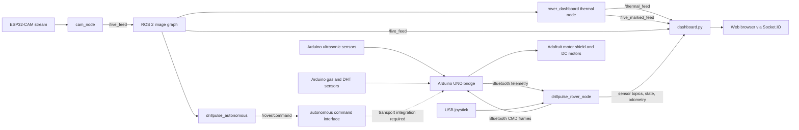
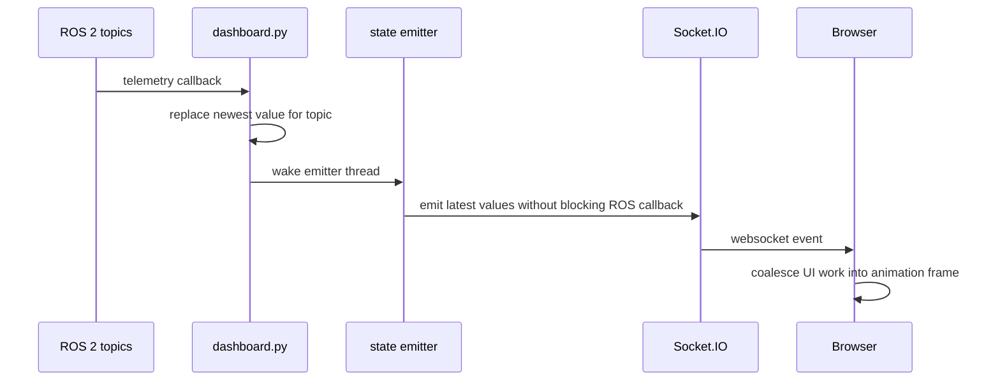

# Mine Monitor Rover

ROS 2 prototype for a mine, tunnel, and confined-space monitoring rover. The workspace combines manual teleoperation, autonomous navigation, ultrasonic safety sensing, environmental telemetry, camera streaming, synthetic thermal visualization, and a browser dashboard.

The project is also referred to in the source code as **DrillPulse Rover**. `mine_monitor_rover` describes the overall system; `drillpulse_*` is the current package and node naming used by ROS 2.

> **Prototype and safety notice**
>
> This repository is a research and demonstration platform. It is not a certified mine-safety, SIL-rated, or autonomous industrial system. The current odometry is software-predicted, the thermal view is synthetic, and the Bluetooth transport has bandwidth and half-duplex limitations. Test with the drive wheels lifted or in a controlled area before connecting a moving rover.

## Contents

- [System at a glance](#system-at-a-glance)
- [Workspace layout](#workspace-layout)
- [Runtime architecture](#runtime-architecture)
- [Package responsibilities](#package-responsibilities)
- [Hardware and transport flows](#hardware-and-transport-flows)
- [ROS 2 interface](#ros-2-interface)
- [Control modes and safety](#control-modes-and-safety)
- [Camera and vision pipelines](#camera-and-vision-pipelines)
- [Dashboard data path](#dashboard-data-path)
- [Build and run](#build-and-run)
- [Configuration](#configuration)
- [Known limitations](#known-limitations)
- [Development guidance](#development-guidance)

## System at a glance



There are two control integration paths in the repository:

1. **Manual/control-node path:** `drillpulse_rover_node.py` reads a USB joystick, predicts rover motion, and communicates directly with an Arduino through `/dev/rfcomm0` at 9600 baud.
2. **Autonomous ROS path:** `drillpulse_autonomous` publishes high-level movement commands on `/rover/command`. A compatible command bridge is required to connect that topic to the Arduino transport. The current Python manual controller is not that subscriber.

Do not assume that launching both paths makes them arbitrate safely. Select one active motor-command authority or add an explicit command multiplexer with a hardware-level safety controller.

## Workspace layout

```text
ros2_ws/
├── README.md                         # This system-level document
├── GITHUB_LANDING_README.md          # Earlier project landing-page draft
├── setup_install.bash                # ROS, Python dependencies, and build helper
├── yolo11n-seg.pt                    # YOLO segmentation model used by thermal.py
├── src/
│   ├── drillpulse_autonomous/
│   │   ├── drillpulse_autonomous/
│   │   │   ├── autonomous_controller.py
│   │   │   ├── camera_stream.py
│   │   │   ├── coordinate_manager.py
│   │   │   ├── free_roam_mode.py
│   │   │   ├── navigation_manager.py
│   │   │   ├── obstacle_detector.py
│   │   │   ├── path_planner.py
│   │   │   ├── point_navigation_mode.py
│   │   │   ├── safety_manager.py
│   │   │   ├── state_machine.py
│   │   │   ├── ultrasonic_manager.py
│   │   │   ├── vision_manager.py
│   │   │   └── utils.py
│   │   ├── config/
│   │   ├── launch/autonomous.launch.py
│   │   └── scripts/
│   ├── drillpulse_control/
│   │   └── drillpulse_control/
│   │       ├── drillpulse_rover_node.py
│   │       ├── cam_node.py
│   │       ├── drillpulse_arduino_wifi_bridge/
│   │       │   └── drillpulse_arduino_wifi_bridge.ino
│   │       ├── drillpulse_esp32_wifi_bridge/
│   │       │   └── drillpulse_esp32_wifi_bridge.ino
│   │       ├── esp32_cam_publish/
│   │       │   └── esp32_cam_publish.ino
│   │       └── DrillPulse_ESP32_WiFi_UART_Configuration.txt
│   └── rover_dashboard/
│       ├── rover_dashboard/dashboard.py
│       ├── rover_dashboard/thermal.py
│       ├── rover_dashboard/web/
│       └── launch/dashboard.launch.py
├── build/                            # Generated colcon output
├── install/                          # Generated ROS installation
└── log/                              # Generated colcon logs
```

`build/`, `install/`, and `log/` are generated artifacts. Source changes belong under `src/` or in the workspace documentation and setup scripts.

## Runtime architecture

### Manual control and hardware telemetry

`drillpulse_control/drillpulse_rover_node.py` is the current high-performance manual controller. Its main responsibilities are:

- polling a USB joystick in a dedicated control loop
- applying dead zones and mapping axes/buttons to rover commands
- cycling speed modes
- managing rollback and point-to-point virtual navigation features
- maintaining independent Bluetooth RX and TX threads
- parsing Arduino sensor/status lines
- publishing sensor, control-state, motor, and predicted-odometry topics
- stopping the rover when command keepalives or the motor watchdog expire

The node uses a bounded latest-command model for Bluetooth TX. It does not allow an old movement queue to build up behind a newer joystick command.

### Autonomous control

`drillpulse_autonomous/autonomous_controller.py` composes the autonomous subsystems and runs the navigation tick, normally at the configured camera/FPS rate. The control order is designed to give safety precedence:

1. read the latest ultrasonic and vision state
2. evaluate safety overrides
3. update the state machine
4. select free-roam or point-navigation behavior
5. publish a high-level motor intent
6. update predicted coordinates and diagnostics

The autonomous package publishes `/rover/command`, but this workspace does not provide a single shared command-arbitration node that merges it with manual joystick commands. That integration must be designed before autonomous and manual control are enabled together on physical hardware.

### Dashboard and processing

The dashboard launch starts two ROS 2 nodes:

- `thermal`: consumes `/live_feed`, runs YOLO segmentation, creates a synthetic thermal visualization, and publishes compressed thermal and marked frames.
- `dashboard`: consumes camera and telemetry topics, serves the static web UI, and forwards current values to browsers through Flask-SocketIO.

The dashboard uses latest-value state fan-out for telemetry and bounded image work. This keeps high-rate odometry, joystick, and camera traffic from blocking one another. Intermediate high-rate samples may be coalesced; the browser is designed to show the newest state, not archive every sample.

## Package responsibilities

### `drillpulse_autonomous`

| File | Responsibility |
| --- | --- |
| `autonomous_controller.py` | Creates all autonomous managers and runs the main timer. |
| `navigation_manager.py` | Coordinates safety, state, vision, planning, and motor intent. |
| `state_machine.py` | Valid states: `IDLE`, `FREE_ROAM`, `POINT_NAVIGATION`, `OBSTACLE_AVOIDANCE`, `RECOVERY`, `GOAL_REACHED`, `EMERGENCY_STOP`. |
| `free_roam_mode.py` | Computes exploratory movement and local recovery behavior. |
| `point_navigation_mode.py` | Computes movement toward a selected coordinate. |
| `vision_manager.py` | Owns the latest camera frame and calls the OpenCV obstacle detector. |
| `camera_stream.py` | Subscribes to the camera topic or supplies simulation/webcam frames. |
| `obstacle_detector.py` | Uses OpenCV edges, contours, corridor geometry, and diagnostic overlays. |
| `ultrasonic_manager.py` | Stores left/right range readings and evaluates distance bands. |
| `safety_manager.py` | Applies critical-stop, warning, camera, and sensor-availability rules. |
| `motor_manager.py` | Converts navigation intents into `/rover/command` and speed messages. |
| `coordinate_manager.py` | Maintains dead-reckoned coordinates and navigation targets. |
| `path_planner.py` | Provides local route/path planning utilities. |
| `config/autonomous.yaml` | Default topics, thresholds, image, and navigation parameters. |
| `config/navigation_points.yaml` | Named navigation targets. |
| `launch/autonomous.launch.py` | Launches autonomous mode with free/point and simulation arguments. |

The autonomous vision pipeline is a lightweight OpenCV corridor/obstacle pipeline. It is separate from the YOLO-based synthetic thermal pipeline in `rover_dashboard`.

### `drillpulse_control`

| File or directory | Responsibility |
| --- | --- |
| `drillpulse_rover_node.py` | Manual joystick control, Bluetooth manager, sensor parsing, rollback, virtual odometry, and state topics. |
| `cam_node.py` | Reads the ESP32-CAM HTTP stream in a background thread and publishes `/live_feed`. |
| `drillpulse_arduino_wifi_bridge/` | Arduino UNO sketch for HC-05 Bluetooth, motor control, and sensors. The name is historical; the sketch itself uses Bluetooth `SoftwareSerial`. |
| `drillpulse_esp32_wifi_bridge/` | Optional ESP32 Wi-Fi TCP-to-UART bridge with two TCP client slots. |
| `esp32_cam_publish/` | ESP32-CAM HTTP stream and still-capture firmware. |
| `DrillPulse_ESP32_WiFi_UART_Configuration.txt` | Wiring, protocol, and troubleshooting notes for the ESP32 UART bridge. |

The package also installs legacy/auxiliary Python entry points such as `joystick_sender`, `virtual_odometry`, `map_visualizer`, `joystick`, and `central`. The active unified controller is the `joystick` entry point, and the camera publisher is `central`.

### `rover_dashboard`

| File | Responsibility |
| --- | --- |
| `rover_dashboard/dashboard.py` | ROS-to-browser bridge, Socket.IO server, telemetry fan-out, and camera forwarding. |
| `rover_dashboard/thermal.py` | YOLO segmentation, synthetic thermal compositing, marked frames, and detection text. |
| `rover_dashboard/web/index.html` | Dashboard panels and telemetry fields. |
| `rover_dashboard/web/app.js` | Socket.IO client, feed updates, gauges, radar, joystick, navigation state, and settings. |
| `rover_dashboard/web/style.css` | Responsive visual layout and feed/panel styling. |
| `launch/dashboard.launch.py` | Starts `thermal` and `dashboard`. |

## Hardware and transport flows

### Arduino UNO and HC-05 Bluetooth

The active Arduino sketch is:

```text
src/drillpulse_control/drillpulse_control/
  drillpulse_arduino_wifi_bridge/drillpulse_arduino_wifi_bridge.ino
```

Its hardware mapping is:

| Device | Arduino connection |
| --- | --- |
| HC-05 RX/TX | SoftwareSerial pins D10/D11 |
| MQ-4 analog | A0 |
| MQ-4 digital | D2 |
| DHT22 | A1 |
| Left ultrasonic trigger/echo | A2/A3 |
| Right ultrasonic trigger/echo | A4/A5 |
| Motors | Adafruit Motor Shield ports M1-M4 |

The Arduino loop is intentionally non-blocking at the application level:

1. service Bluetooth RX one byte at a time
2. parse and apply valid motor/full-control commands
3. run the motor watchdog
4. advance the ultrasonic state machine
5. read DHT22 at its slower interval
6. read MQ-4 and transmit telemetry only when allowed

### Bluetooth command protocol

Preferred framed commands:

```text
<CMD,sequence,x,y,speed>\n
<FULL,1>\n
<FULL,0>\n
```

Examples:

```text
<CMD,125,0.000,1.000,2>
<FULL,1>
<FULL,0>
```

The Arduino also accepts unframed compatibility lines:

```text
CMD,sequence,x,y,speed\n
CMD,x,y,speed\n
FULL,1\n
FULL,0\n
```

`x` and `y` are normalized joystick values. The Arduino applies a dead zone, maps them to forward/back/left/right or differential drive, and selects PWM from speed mode `0`, `1`, or `2`.

### Arduino telemetry protocol

When telemetry is permitted, the Arduino sends one compact line:

```text
S,TEMP,HUMIDITY,MQ4_ANALOG,MQ4_DIGITAL,LEFT_DISTANCE,RIGHT_DISTANCE
```

Example:

```text
S,24.50,58.20,60,0,12.4,9.8
```

The Python controller parses this line and publishes six ROS sensor topics. Legacy labeled telemetry is also accepted by the controller for compatibility.

### Why Bluetooth is not fully parallel

The Arduino UNO is single-core, and `SoftwareSerial` is not a true hardware full-duplex transport. At 9600 baud, motor commands, keepalives, sensor telemetry, and status lines share one narrow serial channel. Concurrent writes would risk byte interleaving, parser corruption, delayed commands, and stale telemetry.

For that reason the implementation deliberately uses priority and coalescing:

- Bluetooth RX is serviced before sensor transmission.
- New movement commands replace older pending movement commands.
- Telemetry is suppressed while the rover is moving or while RX traffic is waiting.
- Full-control mode blocks sensor acquisition/transmission and clears the current sensor snapshot.
- A 450 ms Arduino motor watchdog releases the motors when valid commands stop.
- The Python controller has independent RX and TX threads, but the physical Arduino link remains serial and bandwidth-limited.

This is a safety-oriented scheduling compromise, not true parallel hardware communication. A production design should use a hardware UART, a dedicated motor controller, explicit packet acknowledgements, sequence validation, and a separate safety MCU or hardwired emergency-stop circuit.

### Optional ESP32 Wi-Fi-to-UART bridge

`drillpulse_esp32_wifi_bridge.ino` provides an alternate transport:

```text
TCP clients : port 5000, maximum 2
UART2 RX    : GPIO16
UART2 TX    : GPIO17
UART        : 115200
```

Recognized TCP lines beginning with `CMD,`, `SPEED,`, `STOP`, or `PING` are forwarded to the Arduino UART. Arduino lines are broadcast to both connected TCP clients. The bridge supports a joystick client and a central telemetry client, but both clients still share one UART and one Arduino command stream.

The current `drillpulse_rover_node.py` defaults to `/dev/rfcomm0`; it does not automatically open a TCP connection to port 5000. Treat the ESP32 bridge as an alternate integration path requiring a matching TCP client or adapter.

## ROS 2 interface

### Autonomous package topics

| Topic | Type | Direction | Meaning |
| --- | --- | --- | --- |
| `/camera/image_raw` | `sensor_msgs/msg/Image` | input | Camera frames for autonomous vision. |
| `/left_distance` | `std_msgs/msg/Float32` | input | Left ultrasonic distance in cm. |
| `/right_distance` | `std_msgs/msg/Float32` | input | Right ultrasonic distance in cm. |
| `/rover/command` | `std_msgs/msg/String` | output | High-level movement command interface. |
| `/speed_mode` | `std_msgs/msg/Int32` | output | Autonomous speed mode. |

### Manual controller topics

| Topic | Type | Direction | Meaning |
| --- | --- | --- | --- |
| `/joystick_value` | `sensor_msgs/msg/Joy` | output | Current joystick axes/buttons. |
| `/speed_mode` | `std_msgs/msg/Int8` | output | Manual speed mode: `0` slow, `1` normal, `2` turbo. |
| `/full_control` | `std_msgs/msg/Bool` | output | Full-control mode state. |
| `/rollback_status` | `std_msgs/msg/String` | output | Rollback state, progress, distance, and mode. |
| `/autonomous_status` | `std_msgs/msg/String` | output | Manual/autonomous point-navigation status. |
| `/virtual_odom` | `nav_msgs/msg/Odometry` | output | Predicted pose and velocity. |
| `/virtual_path` | `nav_msgs/msg/Path` | output | Bounded predicted path. |
| `/drillpulse/temperature` | `std_msgs/msg/Float32` | output | DHT temperature. |
| `/drillpulse/humidity` | `std_msgs/msg/Float32` | output | DHT humidity. |
| `/drillpulse/gas` | `std_msgs/msg/Int32` | output | MQ-4 analog value. |
| `/drillpulse/gas_status` | `std_msgs/msg/Int32` | output | MQ-4 digital state. |
| `/drillpulse/left_distance` | `std_msgs/msg/Float32` | output | Left Arduino ultrasonic value. |
| `/drillpulse/right_distance` | `std_msgs/msg/Float32` | output | Right Arduino ultrasonic value. |
| `/drillpulse/motor_left` | `std_msgs/msg/Int32` | output | Predicted average left motor RPM. |
| `/drillpulse/motor_right` | `std_msgs/msg/Int32` | output | Predicted average right motor RPM. |
| `/drillpulse/status` | `std_msgs/msg/String` | output | Arduino acknowledgements and status lines. |

### Camera and dashboard topics

| Topic | Type | Producer | Consumer |
| --- | --- | --- | --- |
| `/live_feed` | `sensor_msgs/msg/Image` | `cam_node` | dashboard, autonomous vision, thermal node |
| `/thermal_feed` | `sensor_msgs/msg/CompressedImage` | dashboard `thermal` | browser dashboard |
| `/live_marked_feed` | `sensor_msgs/msg/CompressedImage` | dashboard `thermal` | browser dashboard/marked-feed clients |
| `/thermal/detections` | `std_msgs/msg/String` | dashboard `thermal` | optional monitoring clients |
| `/drillpulse/camera_status` | `std_msgs/msg/String` | `cam_node` | optional monitoring clients |

The dashboard topic names are ROS parameters and can be remapped at launch.

## Control modes and safety

### Manual joystick mode

The controller polls the joystick at approximately 50 Hz. The default button assignments are discovered from available buttons:

- Button 0: cycle speed mode
- Button 2: start/cancel rollback
- next available button: autonomous point-to-point mode
- next available button: full-control mode

The joystick controller sends direction/speed packets through its Bluetooth TX manager. Centered input sends a stop event; moving input receives periodic keepalives.

### Full-control mode

Full-control mode is a deliberate sensor-suppression state for direct operator control. When enabled:

- Arduino sensor servicing and sensor telemetry stop.
- Arduino sensor values are cleared.
- Python sensor state is invalidated.
- pending Bluetooth RX data is flushed.
- late sensor packets are rejected by the Python controller.
- the dashboard hides/blocks stale sensor values.

When full-control is disabled, only newly received sensor packets are accepted.

### Autonomous safety rules

Default autonomous distance bands are:

- below 15 cm: critical stop/recovery
- below 25 cm: warning steering response
- below 35 cm: caution/slow behavior

Unavailable ultrasonic input is treated as a safety failure by the autonomous safety manager. A disconnected camera can fall back to ultrasonic safety mode, but this behavior must be validated for the actual vehicle and environment.

### Motor failsafe

The Arduino releases all motors if a valid movement command has not refreshed the watchdog within approximately 450 ms. This protects against a stopped computer, disconnected Bluetooth link, or broken command loop. It is not a replacement for an independently wired emergency stop.

## Camera and vision pipelines

### ESP32-CAM to ROS

`cam_node.py` opens the configured ESP32-CAM HTTP multipart stream, keeps a small OpenCV buffer, limits publication to approximately 20 FPS, and publishes raw BGR frames on `/live_feed`. The current camera IP is hardcoded in the node (`ESP32_CAM_IP`), so deployment requires changing that value or parameterizing it before moving between networks.

### Autonomous OpenCV vision

The autonomous package uses `camera_stream.py`, `vision_manager.py`, and `obstacle_detector.py`. This path performs corridor and obstacle analysis with OpenCV and supplies a recommended direction to navigation. It is intended for fast navigation cues and is not the same model used by the dashboard thermal node.

### Dashboard YOLO thermal view

`rover_dashboard/thermal.py` loads `yolo11n-seg.pt`, tracks supported objects, and composites a colorized thermal-style image. This is **synthetic thermal visualization** derived from RGB frames; it is not a calibrated infrared temperature sensor. Detection labels and temperatures should not be used as certified safety measurements.

## Dashboard data path



Camera frames use a separate bounded latest-frame path. Raw frames are JPEG encoded by the dashboard bridge; compressed thermal and marked frames are forwarded after validation. Image work is rate-limited so camera processing cannot continuously starve telemetry updates.

The dashboard is intentionally a live-state display. At high publish rates it may skip intermediate samples while preserving the newest value for each topic. Use rosbag2 or a dedicated recorder when every sample must be retained.

## Build and run

### Prerequisites

The setup script targets ROS 2 Jazzy and expects:

- Ubuntu/Linux with ROS 2 Jazzy sourced at `/opt/ros/jazzy`
- Python 3 and `venv`
- `colcon-common-extensions`
- OpenCV and `cv_bridge`
- Flask, Flask-SocketIO, and Python Socket.IO
- NumPy, PyYAML, Ultralytics, and `lap` for the dashboard thermal pipeline
- a compatible Arduino/ESP32 toolchain for firmware builds

### Workspace setup

```bash
cd ~/ros2_ws
bash setup_install.bash
source /opt/ros/jazzy/setup.bash
source .venv/bin/activate
source install/setup.bash
```

The helper installs Python dependencies and builds the dashboard and control packages. Autonomous package dependencies should also be installed when using the autonomous stack.

### Build all ROS packages

```bash
cd ~/ros2_ws
source /opt/ros/jazzy/setup.bash
colcon build --symlink-install
source install/setup.bash
```

Useful focused builds:

```bash
colcon build --packages-select drillpulse_autonomous --symlink-install
colcon build --packages-select drillpulse_control --symlink-install
colcon build --packages-select rover_dashboard --symlink-install
```

### Start the dashboard

```bash
ros2 launch rover_dashboard dashboard.launch.py
```

Open:

```text
http://<rover-computer-ip>:8080/
```

The launch file starts both the dashboard bridge and the YOLO thermal node. Start `cam_node` separately when using the ESP32-CAM ROS publisher:

```bash
ros2 run drillpulse_control central
```

### Start autonomous navigation

Free roam:

```bash
ros2 launch drillpulse_autonomous autonomous.launch.py mode:=free simulation:=false
```

Point navigation:

```bash
ros2 launch drillpulse_autonomous autonomous.launch.py \
  mode:=point goal_x:=5.0 goal_y:=8.0 simulation:=false
```

Simulation/webcam mode:

```bash
ros2 launch drillpulse_autonomous autonomous.launch.py \
  mode:=free simulation:=true
```

### Start manual control

```bash
ros2 run drillpulse_control joystick
```

The default manual hardware path expects `/dev/rfcomm0` at 9600 baud and a working USB joystick. Do not run an autonomous command publisher and manual controller against the same motors without a command-arbitration design.

### Inspect the graph

```bash
ros2 node list
ros2 topic list
ros2 topic echo /drillpulse/status
ros2 topic echo /drillpulse/temperature
ros2 topic hz /live_feed
ros2 topic hz /virtual_odom
ros2 topic info /rover/command
```

## Configuration

### Autonomous parameters

Defaults are in:

```text
src/drillpulse_autonomous/drillpulse_autonomous/config/autonomous.yaml
```

Important parameters include camera and ultrasonic topic names, motor command topic, speed topic, safety distances, image dimensions, Canny thresholds, FPS, webcam ID, and simulation mode.

### Dashboard parameters

`dashboard.py` declares parameters for all subscribed topics, including:

```text
web_port
live_feed_topic
thermal_feed_topic
marked_feed_topic
temperature_topic
humidity_topic
gas_reading_topic
gas_status_topic
left_distance_topic
right_distance_topic
speed_mode_topic
motor_left_topic
motor_right_topic
status_topic
joystick_topic
rollback_status_topic
autonomous_status_topic
full_control_topic
odom_topic
path_topic
```

Example:

```bash
ros2 launch rover_dashboard dashboard.launch.py \
  web_port:=8080 \
  live_feed_topic:=/camera/front/image_raw \
  temperature_topic:=/sensors/temperature
```

### Firmware configuration

Before flashing, verify the pin mapping, motor shield library, DHT library, Bluetooth baud rate, ESP32 Wi-Fi credentials, UART pins, and camera network address. Never commit production Wi-Fi passwords or private credentials to a public repository.

## Known limitations

### Transport and concurrency

- Arduino UNO `SoftwareSerial` is not true full-duplex and runs at only 9600 baud in the current sketch.
- Motor commands and sensor telemetry share one serial channel.
- Telemetry is intentionally suppressed during movement and full-control mode.
- The ESP32 bridge has two TCP client slots, but both clients share one UART and one Arduino stream.
- The current Python manual controller uses direct RFCOMM, not the ESP32 TCP bridge, unless an additional adapter is added.
- Dashboard latest-value fan-out coalesces intermediate samples. It is not a lossless telemetry recorder.

### State estimation and sensing

- The manual controller's odometry, RPM, rotations, and path are predicted in software because the current implementation has no physical wheel encoders.
- The autonomous coordinate manager is dead reckoning, not SLAM or surveyed localization.
- The dashboard thermal image is an RGB-to-color visualization, not physical thermal imaging or calibrated temperature measurement.
- Ultrasonic readings can be invalid or unavailable because of echo timeout, wiring, surface angle, or shared timing constraints.
- MQ-4 and DHT values require calibration and environmental validation before safety decisions are based on them.

### Integration and operational safety

- There is no single hardware-independent command arbiter shared by manual and autonomous control.
- The software motor watchdog does not replace a physical emergency stop.
- Camera IP addresses and some firmware network credentials are currently source-level configuration.
- The autonomous safety thresholds are defaults, not a validated mine profile.
- No production-level cybersecurity, authentication, encrypted transport, redundant sensing, formal hazard analysis, or certification is provided.

## Development guidance

Before changing control behavior:

1. Identify the command authority and transport path being tested.
2. Test with motors physically disabled or lifted.
3. Confirm the motor watchdog still stops motion when the sender disappears.
4. Verify `/rover/command`, Bluetooth/RFCOMM, or TCP bridge traffic separately.
5. Check sensor values and timestamps while stationary and while moving.
6. Confirm dashboard behavior under camera load using `ros2 topic hz`.

For a production evolution, prioritize:

- a dedicated hardware motor/safety controller and wired emergency stop
- hardware UART or CAN instead of Arduino `SoftwareSerial`
- explicit command arbitration between manual and autonomous modes
- packet sequence numbers, acknowledgements, CRC, and link-health state
- wheel encoders and a real localization stack
- calibrated gas and thermal sensing
- deterministic QoS and recorded telemetry requirements
- authenticated/encrypted network transport
- hardware-in-the-loop and fault-injection tests
- a documented hazard analysis and operational envelope

## License and status

The source packages contain MIT and prototype metadata in their individual manifests. Review and standardize licensing and maintainer information before publishing a production repository.

This project is currently a functional robotics prototype intended for research, demonstration, and iterative field-development work.
