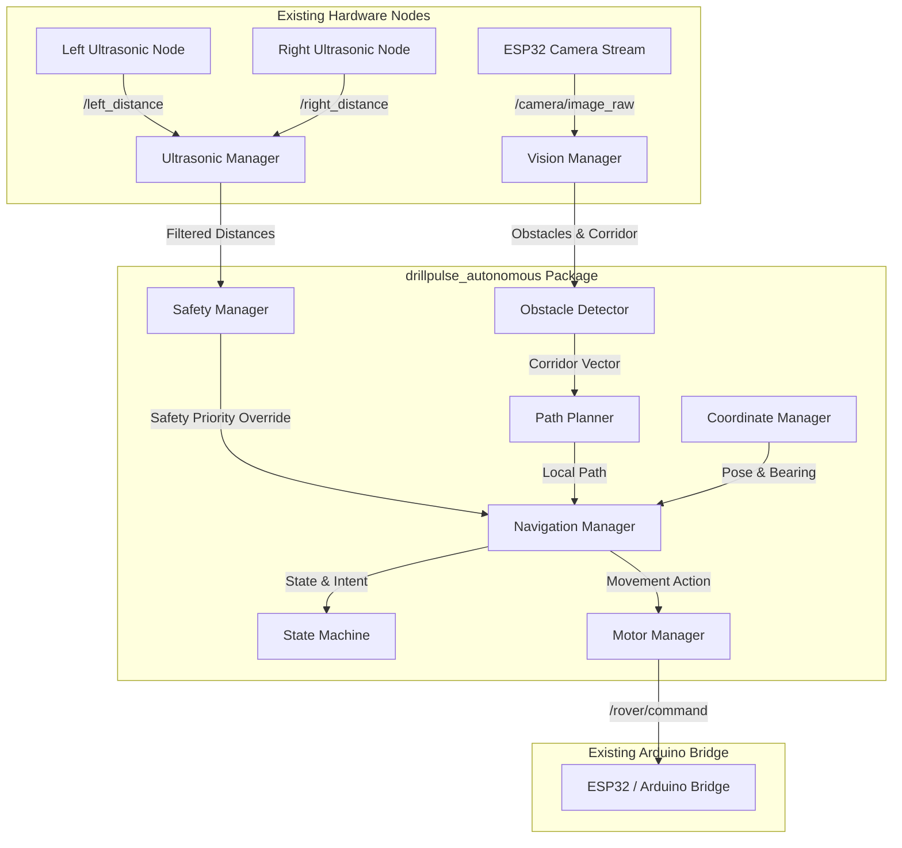

# DrillPulse Autonomous ROS2 Package (`drillpulse_autonomous`)

Complete, self-contained ROS2 Python autonomous driving module for the DrillPulse Mini Rover. Plugs seamlessly into the existing DrillPulse rover workspace without modifying any pre-existing packages, code, launch files, topic protocols, or micro-controller code.

---

## 📌 Architecture Overview



---

## 📁 Directory Structure

```
ros2_ws/src/drillpulse_autonomous/
├── package.xml                  # ROS2 ament_python package manifest
├── setup.py                     # Setuptools configuration & script entrypoints
├── setup.cfg                    # Setuptools binary script paths
├── README.md                    # Comprehensive documentation
├── resource/
│   └── drillpulse_autonomous    # ROS2 package marker
├── config/
│   ├── autonomous.yaml          # ROS2 topic, threshold, and vision parameters
│   └── navigation_points.yaml   # Saved target coordinates (Home, Lab, Desk, Door)
├── launch/
│   └── autonomous.launch.py     # Main ROS2 launch file with CLI arguments
├── scripts/
│   ├── start_autonomous.sh      # Bash script to start autonomous modes
│   └── stop_autonomous.sh       # Bash script to emergency stop & kill nodes
└── drillpulse_autonomous/
    ├── __init__.py              # Python package initializer
    ├── utils.py                 # Color logging, math, & angle helpers
    ├── camera_stream.py         # Image subscriber, watchdog, & simulation webcam
    ├── ultrasonic_manager.py    # Median filtering, noise removal, & distance tracking
    ├── obstacle_detector.py     # Pure OpenCV vision pipeline & HUD renderer
    ├── vision_manager.py        # Vision coordinator & OpenCV window display
    ├── safety_manager.py        # High-priority safety rules & emergency recovery
    ├── motor_manager.py         # Converts intents to existing /rover/command
    ├── coordinate_manager.py    # Target coordinates & dead-reckoning pose tracking
    ├── path_planner.py          # Local path planner & A* grid search
    ├── state_machine.py         # Finite state machine (IDLE, FREE, POINT, SAFETY)
    ├── free_roam_mode.py        # Mode 1: Autonomous exploration & swarm mode
    ├── point_navigation_mode.py # Mode 2: Goal coordinate navigation
    ├── navigation_manager.py    # Central loop coordinator
    └── autonomous_controller.py # Main ROS2 Node class entrypoint
```

---

## 🚀 Key Features

- **Mode 1: Free Roam / Swarm Mode**: Continuous autonomous exploration with random bias, corner escape, dead-end recovery, and wall avoidance.
- **Mode 2: Point-to-Point Navigation**: Autonomous goal-seeking using coordinate targets (`goal_x`, `goal_y`), bearing calculation, and obstacle re-routing.
- **High-Priority Safety Manager**: Instant priority override on critical ultrasonic proximity (< 15 cm critical stop, < 25 cm warning steer).
- **Pure OpenCV Vision Pipeline**: No heavy AI/ML dependencies (no YOLO/PyTorch). Fast Canny edge detection, morphology, and contour corridor segmentation.
- **Diagnostic HUD Display**: Renders real-time HUD window (`DRILLPULSE AUTONOMOUS VIEW`) with obstacle bounding boxes, safe corridor, steering arrows, ultrasonic gauges, state, and FPS.
- **Non-Invasive Architecture**: Subscribes only to existing topics (`/camera/image_raw`, `/left_distance`, `/right_distance`) and publishes to `/rover/command`.

---

## 🔧 Installation & Build Instructions

### 1. Requirements
Ensure your ROS2 environment has the standard dependencies installed:
```bash
sudo apt update
sudo apt install ros-${ROS_DISTRO}-cv-bridge python3-opencv python3-yaml
```

### 2. Build Package
From your workspace root (`ros2_ws`):
```bash
cd ros2_ws
colcon build --packages-select drillpulse_autonomous
source install/setup.bash
```

---

## 🎮 Execution Commands

### Mode 1 — Free Roam Mode
Starts the rover in continuous autonomous exploration mode:
```bash
ros2 launch drillpulse_autonomous autonomous.launch.py mode:=free
```

### Mode 2 — Point to Point Navigation
Drive to target destination coordinates (e.g. X=5.0, Y=8.0):
```bash
ros2 launch drillpulse_autonomous autonomous.launch.py mode:=point goal_x:=5 goal_y:=8
```

### Point Navigation Terminal CLI
You can also launch point navigation directly via `ros2 run`:
```bash
ros2 run drillpulse_autonomous point_navigation --goal 5 8
```

### Simulation Mode (Webcam / Windows Testing)
Test autonomous navigation using a laptop webcam and simulated distance values:
```bash
ros2 launch drillpulse_autonomous autonomous.launch.py simulation:=true
```

### Helper Shell Scripts
```bash
# Start Free Roam
bash src/drillpulse_autonomous/scripts/start_autonomous.sh free

# Start Point Navigation
bash src/drillpulse_autonomous/scripts/start_autonomous.sh point 5 8

# Emergency Stop & Kill Autonomous Node
bash src/drillpulse_autonomous/scripts/stop_autonomous.sh
```

---

## 📡 ROS2 Topic Interface

| Topic Name | Type | Direction | Description |
| :--- | :--- | :--- | :--- |
| `/camera/image_raw` | `sensor_msgs/msg/Image` | Subscriber | Live ESP32 camera stream |
| `/left_distance` | `std_msgs/msg/Float32` | Subscriber | Left ultrasonic distance (cm) |
| `/right_distance` | `std_msgs/msg/Float32` | Subscriber | Right ultrasonic distance (cm) |
| `/rover/command` | `std_msgs/msg/String` | Publisher | Motor movement commands (`CMD,X,Y`) |
| `/speed_mode` | `std_msgs/msg/Int32` | Publisher | Active speed level (1, 2, 3) |

---

## 💻 Portability Notice (Windows → Ubuntu Transfer)

This package uses **ROS2 package relative paths** (`get_package_share_directory('drillpulse_autonomous')`).
No hardcoded paths (`C:\...` or `/home/...`) exist.
Simply ZIP the `drillpulse_autonomous` folder and extract it into any Ubuntu ROS2 workspace `src/` directory.
